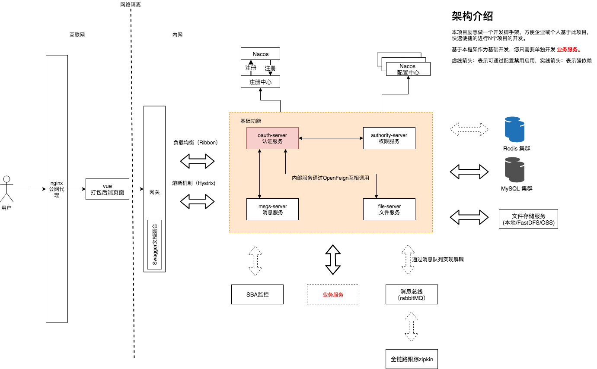
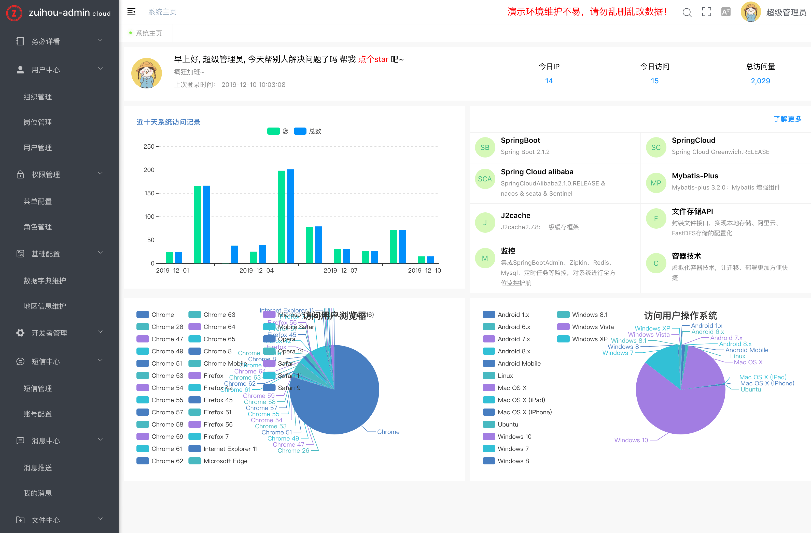
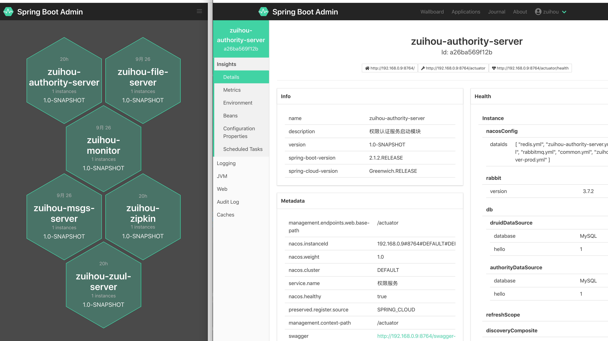
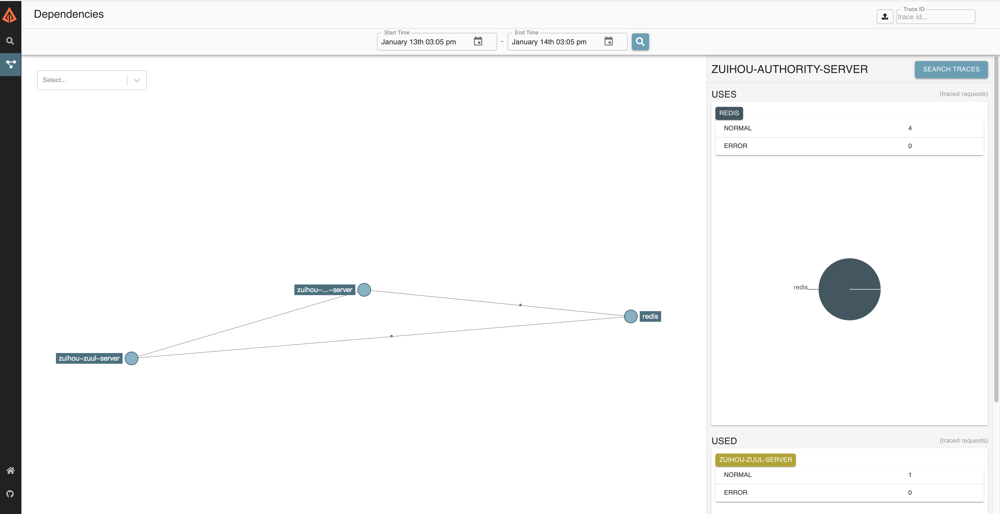
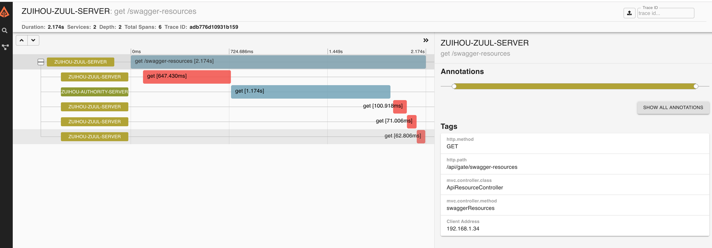
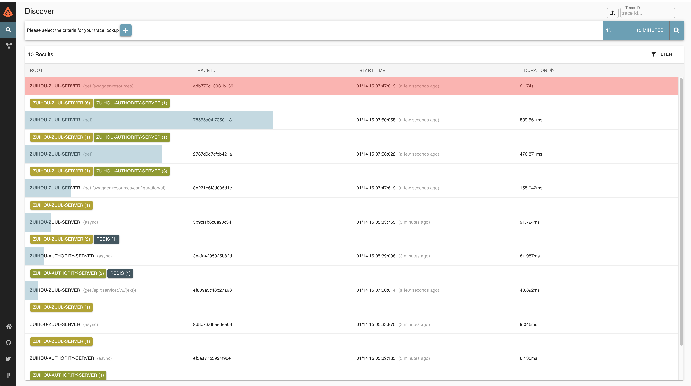
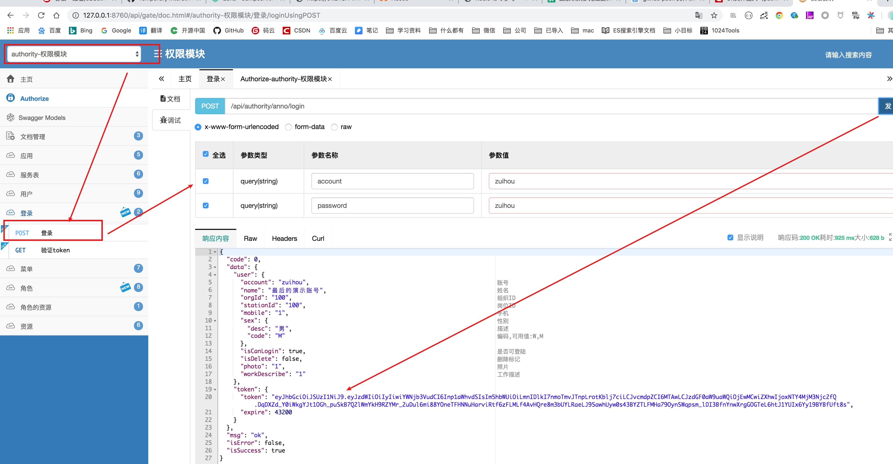
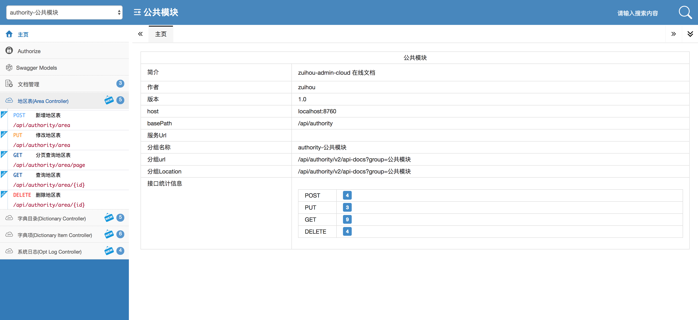
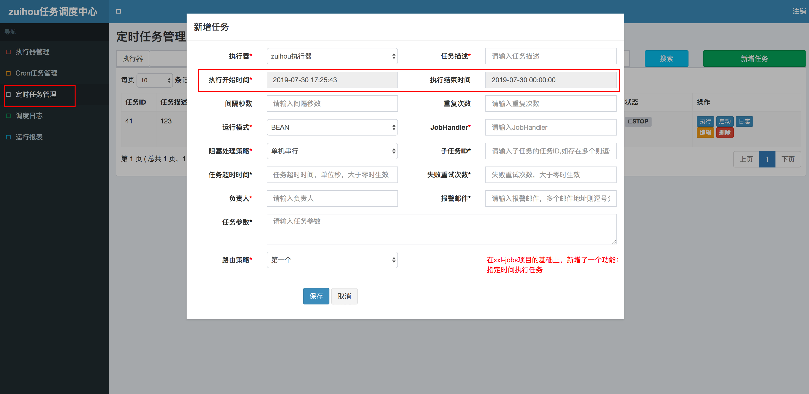

# zuihou-admin-cloud

[](https://github.com/zuihou/zuihou-admin-cloud/blob/master/LICENSE)
[](https://github.com/zuihou/zuihou-admin-cloud)
[](https://github.com/zuihou/zuihou-admin-cloud)
[](https://github.com/zuihou/zuihou-admin-cloud/stargazers)
[](https://gitee.com/zuihou111/zuihou-admin-cloud/stargazers)
[](https://github.com/zuihou/zuihou-admin-cloud/network/members)
[](https://gitee.com/zuihou111/zuihou-admin-cloud/members)


## 简介：
基于`SpringCloud(Hoxton.SR1)`  + `SpringBoot(2.2.2.RELEASE)` 的 SaaS型微服务脚手架，具备用户管理、资源权限管理、网关统一鉴权、Xss防跨站攻击、自动代码生成、多存储系统、分布式事务、分布式定时任务等多个模块，支持多业务系统并行开发，
支持多服务并行开发，可以作为后端服务的开发脚手架。代码简洁，架构清晰，非常适合学习使用。核心技术采用Nacos、Fegin、Ribbon、Zuul、Hystrix、JWT Token、Mybatis、SpringBoot、Seata、Nacos、Sentinel、
RabbitMQ、FastDFS等主要框架和中间件。

希望能努力打造一套从 `SaaS基础框架` - `分布式微服务架构` - `持续集成` - `系统监测` 的解决方案。`本项目旨在实现基础能力，不涉及具体业务。`

部署方面, 可以采用以下4种方式，并会陆续公布jenkins集合以下3种部署方式的脚本和配置文件：
- IDEA 启动
- jar部署
- docker部署
- k8s部署

## 如果觉得对您有任何一点帮助，请点右上角 "Star" 支持一下吧，谢谢！

## 详细文档: https://www.kancloud.cn/zuihou/zuihou-admin-cloud
http://doc.tangyh.top/zuihou-admin-cloud

    ps: gitee捐献 或者 二维码打赏（本页最下方）： 45元及以上 备注邮箱，可得开发文档一份（支持后续更新） （比看云的价格便宜哦）


## 交流群： 63202894
 <a target="_blank" href="http://shang.qq.com/wpa/qunwpa?idkey=489800b9d07d017fa0b5104608a4bf755f1f38276b79f0ac5e6225d0d9897efb"></a>

    加群前请先将下方项目点star，支持下群主，谢谢😘

## 项目代码地址

| 项目 | gitee | github | 备注 |
|---|---|---|---|
| 微服务项目 | https://gitee.com/zuihou111/zuihou-admin-cloud | https://github.com/zuihou/zuihou-admin-cloud | SpringCloud 版本 |
| 单体项目 | https://gitee.com/zuihou111/zuihou-admin-boot | https://github.com/zuihou/zuihou-admin-boot | SpringBoot 版本 |
| 租户后台 | https://gitee.com/zuihou111/zuihou-ui | https://github.com/zuihou/zuihou-ui | 给客户使用 |
| 开发&运营后台 | https://gitee.com/zuihou111/zuihou-admin-ui | https://github.com/zuihou/zuihou-admin-ui | 给公司内部开发&运营&运维等人员使用 |
| 代码生成器 | 无 | https://github.com/zuihou/zuihou-generator | 给开发人员使用 |

## zuihou-admin-cloud 演示地址 （服务器没法备案，只能加上端口~~~）

| 项目 | 演示地址 | 管理员账号 | 普通账号 | 
|---|---|---|---|
| 租户后台 | http://tangyh.top:10000/zuihou-ui/ | zuihou/zuihou | test/zuiou |
| 开发&运营后台 | http://tangyh.top:180/zuihou-admin-ui/ | demoAdmin/zuihou | 无 |

> 演示环境中内置租户没有写入权限，若要在演示环境测试增删改，请到`开发&运营后台`自行创建租户后测试
```
租户后台 和 开发&运营后台 2者之间的关系是什么？
A公司 使用这套SaaS脚手架二次开发了一个OA或者商城， B和C公司想使用A公司开发的这套系统，但土豪公司B有钱想要个性化功能，C公司是个穷逼，不愿意多花钱
于是，A公司就在 zuihou-admin-ui（开发&运营后台） 上新建了 租户B 和租户C， 并各自新建了账号b1和账号c1， 分别给B公司和C公司 试用，
B公司和C公司分别拿着账号， 在 zuihou-ui(租户后台) 上试用， 试用很满意，但土豪B公司先要定制功能， 就跟A公司签了一个500W的定制大单，并要求独立部署在他们自己的服务器 
穷逼C公司没钱， 就花了20W使用A公司部署的云环境， 服务器和数据等都存在A公司的云服务器上。
```

## zuihou-admin-boot 演示地址 

| 项目 | 演示地址 | 管理员账号 | 普通账号 |
|---|---|---|---|
| 租户后台 | http://42.202.130.216:10000/zuihou-ui | zuihou/zuihou | test/zuiou |
| 开发&运营后台 | http://42.202.130.216:10000/zuihou-admin-ui | demoAdmin/zuihou | 无 |
| swagger文档 | http://42.202.130.216:10000/api/gate/doc.html | 无 | 无 |
| 定时任务 | http://42.202.130.216:10000/zuihou-jobs-server | zuihou/zuihou | 无  |


## 功能点介绍:
1. **服务注册&发现与调用：**

    基于Nacos来实现的服务注册与发现，使用使用Feign来实现服务互调, 可以做到使用HTTP请求远程调用时能与调用本地方法一样的编码体验，开发者完全感知不到这是远程方法，更感知不到这是个HTTP请求。

2. **服务鉴权:**

    通过JWT的方式来加强服务之间调度的权限验证，保证内部服务的安全性。

3. **负载均衡：**

    将服务保留的rest进行代理和网关控制，除了平常经常使用的node.js、nginx外，Spring Cloud系列的zuul和ribbon，可以帮我们进行正常的网关管控和负载均衡。其中扩展和借鉴国外项目的扩展基于JWT的Zuul限流插件，方面进行限流。

4. **熔断机制：**

    因为采取了服务的分布，为了避免服务之间的调用“雪崩”，采用了Hystrix的作为熔断器，避免了服务之间的“雪崩”。

5. **监控：**

    利用Spring Boot Admin 来监控各个独立Service的运行状态；利用turbine来实时查看接口的运行状态和调用频率；通过Zipkin来查看各个服务之间的调用链等。

5. **链路调用监控：**

    利用Zipkin实现微服务的全链路性能监控， 从整体维度到局部维度展示各项指标，将跨应用的所有调用链性能信息集中展现，可方便度量整体和局部性能，并且方便找到故障产生的源头，生产上可极大缩短故障排除时间。有了它，我们能做到：
    > 请求链路追踪，故障快速定位：可以通过调用链结合业务日志快速定位错误信息。
    > 可视化：各个阶段耗时，进行性能分析。
    >依赖优化：各个调用环节的可用性、梳理服务依赖关系以及优化。
    >数据分析，优化链路：可以得到用户的行为路径，汇总分析应用在很多业务场景。
    
6. **数据权限**

    利用基于Mybatis的DataScopeInterceptor拦截器实现了简单的数据权限

7. **SaaS（多租户）的无感解决方案**

    使用Mybatis拦截器实现对所有SQL的拦截，修改默认的Schema，从而实现多租户数据隔离的目的。 并且支持可插拔。

8. **二级缓存**

    采用J2Cache操作缓存，第一级缓存使用内存(Caffeine)，第二级缓存使用 Redis。 由于大量的缓存读取会导致 L2 的网络成为整个系统的瓶颈，因此 L1 的目标是降低对 L2 的读取次数。
    该缓存框架主要用于集群环境中。单机也可使用，用于避免应用重启导致的缓存冷启动后对后端业务的冲击。

9. **优雅的Bean转换**

    采用Dozer组件来对 DTO、DO、PO等对象的优化转换

10. **前后端统一表单验证**

    严谨的表单验证通常需要 前端+后端同时验证， 但传统的项目，均只能前后端各做一次检验， 后期规则变更，又得前后端同时修改。
    故在`hibernate-validator`的基础上封装了`zuihou-validator-starter`起步依赖，提供一个通用接口，可以获取需要校验表单的规则，然后前端使用后端返回的规则，
    以后若规则改变，只需要后端修改即可。

11. **防跨站脚本攻击（XSS）**
    
    - 通过过滤器对所有请求中的 表单参数 进行过滤
    - 通过Json反序列化器实现对所有 application/json 类型的参数 进行过滤
    
12. **当前登录用户信息注入器**
    
    - 通过注解实现用户身份注入
    
13. **在线API**

    由于原生swagger-ui某些功能支持不够友好，故采用了国内开源的`swagger-bootstrap-ui`，并制作了stater，方便springboot用户使用。

14. **代码生成器**

    基于Mybatis-plus-generator自定义了一套代码生成器， 通过配置数据库字段的注释，自动生成枚举类、数据字典注解、SaveDTO、UpdateDTO、表单验证规则注解、Swagger注解等。

15. **定时任务调度器**：

    基于xxl-jobs进行了功能增强。（如：指定时间发送任务、执行器和调度器合并项目、多数据源）

16. **大文件/断点/分片续传**

    前端采用webupload.js、后端采用NIO实现了大文件断点分片续传，启动Eureka、Zuul、File服务后，直接打开docs/chunkUploadDemo/demo.html即可进行测试。
    经测试，本地限制堆栈最大内存128M启动File服务,5分钟内能成功上传4.6G+的大文件，正式服耗时则会受到用户带宽和服务器带宽的影响，时间比较长。

17. **分布式事务**

    集成了阿里的分布式事务中间件：seata，以 **高效** 并且对业务 **0侵入** 的方式，解决 微服务 场景下面临的分布式事务问题。


## 项目架构图:  架构图.xml -> https://www.draw.io/


## 技术栈/版本介绍：
- 所涉及的相关的技术有：
    - JSON序列化:Jackson
    - 消息队列：RabbitMQ
    - 缓存：Redis
    - 缓存框架：J2Cache
    - 数据库： MySQL 5.7.9 (驱动6.0.6)
    - 定时器：采用xxl-jobs项目进行二次改造
    - 前端：vue
    - 持久层框架： Mybatis-plus
    - 代码生成器：基于Mybatis-plus-generator自定义  [https://github.com/zuihou/zuihou-generator.git]
    - API网关：Zuul
    - 服务注册与发现：Eureka -> Nacos
    - 服务消费：OpenFeign
    - 负载均衡：Ribbon
    - 配置中心：Nacos
    - 服务熔断：Hystrix
    - 项目构建：Maven 3.3
    - 分布式事务： seata
    - 分布式系统的流量防卫兵： Sentinel
    - 监控： spring-boot-admin 2.x
    - 链路调用跟踪： zipkin 2.x
    - 文件服务器：FastDFS 5.0.5/阿里云OSS/本地存储
    - Nginx
- 部署方面：
    - 服务器：CentOS
    - Jenkins
    - Docker 18.09
    - Kubernetes 1.12

本代码采用 Intellij IDEA(2018.1 EAP) 来编写，但源码与具体的 IDE 无关。

PS: Lombok版本过低会导致枚举类型的参数无法正确获取参数，经过调试发现因为版本多低后，导致EnumDeserializer的 Object obj = p.getCurrentValue();取的值为空。

## 如何加入这个项目 或者 修复bug 或者 贡献代码
    0.大致了解项目后（熟练的启动项目），并基于此项目，任意创建一张表完成CRUD  （有疑问的地方可以咨询作者）
    1.尝试找到项目的任意bug并修复,或者联系作者看看有什么新需求可做
    2.Fork & 提交PR
    3.等待合并，合并超过5次的朋友，直接拉为项目开发者

## 项目截图：

| 预览 | 预览 |
|---|---|
|  |  |
|  |  |
|  |  |
|  |   |
|  |  |


## 感谢(排名不分先后)：
- [knife4j](https://gitee.com/xiaoym/knife4j)
- [mybatis-plus](https://gitee.com/baomidou/mybatis-plus)
- [xxl-jobs](https://gitee.com/xuxueli0323/xxl-job)
- [hutool](https://gitee.com/loolly/hutool)
- [guava](https://github.com/google/guava)
- [j2cache](https://gitee.com/ld/J2Cache)

## 写在最后：
    本项目正在开发阶段，由于码主白天要上班，只有晚上、周末能挤点时间来敲敲代码，所以进度可能比较慢，文档、注释也不齐全。 
    各位大侠就将就着看，但随着时间的推移。文档，注释，启动说明等码主我一定会补全的。   

## 打赏作者买瓶防脱发药水吧~~~ o(╥﹏╥)o

    
    ps: gitee捐献 或者 二维码打赏： 45元及以上 备注邮箱，可得开发文档一份（支持后续更新） （比看云的价格便宜哦） 
    
