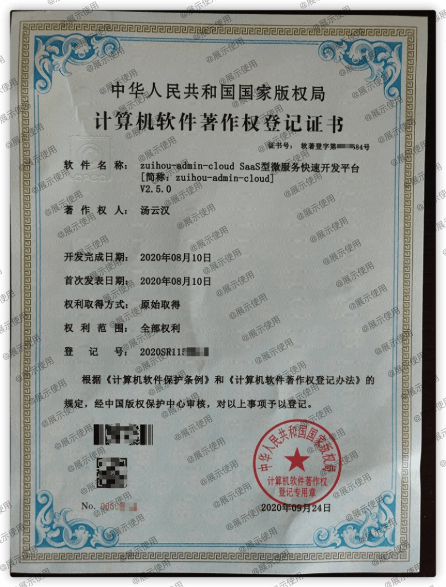

# zuihou-admin-cloud SaaS型微服务快速开发平台

[](https://github.com/zuihou/zuihou-admin-cloud/blob/master/LICENSE)
[](https://github.com/zuihou/zuihou-admin-cloud)
[](https://github.com/zuihou/zuihou-admin-cloud)
[](https://github.com/zuihou/zuihou-admin-cloud/stargazers)
[](https://gitee.com/zuihou111/zuihou-admin-cloud/stargazers)
[](https://github.com/zuihou/zuihou-admin-cloud/network/members)
[](https://gitee.com/zuihou111/zuihou-admin-cloud/members)

## 简介
基于`SpringCloud(Hoxton.SR7)`  + `SpringBoot(2.2.9.RELEASE)` 的 SaaS型微服务快速开发平台，具备用户管理、资源权限管理、网关统一鉴权、Xss防跨站攻击、自动代码生成、多存储系统、分布式事务、分布式定时任务等多个模块，支持多业务系统并行开发，
支持多服务并行开发，可以作为后端服务的开发脚手架。代码简洁，架构清晰，非常适合学习使用。核心技术采用SpringCloud(Nacos、Fegin、Ribbon、Gateway、Hystrix)、SpringBoot、Mybatis Plus、Seata、Sentinel、Redis、RabbitMQ、FastDFS等主要技术。

希望能努力打造一套从 `基础框架` - `微服务架构` - `持续集成` - `系统监测` 的解决方案。

`本项目旨在通过约定表结构设计规范、代码编写规范、模块拆分规范，实现系统的代码生成功能、基础功能、常用功能、通用功能。`

## 项目架构图


## 项目组成及项目名由来
本项目由`zuihou-admin-cloud`、`zuihou-admin-boot`、`zuihou-commons`、`zuihou-ui`、`zuihou-admin-ui`、`zuihou-generator` 等6个项目组成，其中：
- zuihou-commons：是项目的核心工具包，开发宗旨是打造一套按模块独立使用的工具类。 （cloud、boot项目必须先编译它）
- zuihou-admin-cloud：是基于SpringCloud的SaaS型微服务快速开发平台
- zuihou-admin-boot： 是基于SpringBoot的SaaS型单体架构快速开发平台，功能和zuihou-admin-cloud完全一致
- zuihou-generator：  是基于`mybatis-plus-generator`定制的代码生成器，专门按 zuihou-admin-cloud 和 zuihou-admin-boot 项目的结构生成Controller、Service、Dao、Entity、DTO、XML、前端Vue页面等代码。生成代码后，能实现不写一行代码、不移动一个类，即拥有CRUD、导入、导出等功能。
- zuihou-ui： 给客户使用的后台系统
- zuihou-admin-ui： 公司内部管理人员使用的后台管理系统，用于管理租户信息。

项目名解释：
- zuihou：即中文名：最后，是十多年来在各大平台一直使用的网名
- admin： 最初的设想是做一个后台管理系统
- cloud： 基于SpringCloud框架
- boot：  基于SpringBoot框架
- commons： 公共的组件、工具类
- generator： 代码生成
- ui：前端项目

## 模式介绍
本项目可以通过配置，轻松切换项目的 **租户模式**。

| 租户模式 | 描述 | 优点 | 缺点  | 
|---|---|---|---|
| NONE（非租户模式) | 没有租户 | 简单、适合独立系统 | 缺少租户系统的优点 | 
| COLUMN（字段模式) | 租户共用一个数据库，在业务表中增加字段来区分 | 简单、不复杂、开发无感知 | 数据隔离性差、安全性差、数据备份和恢复困难、 | 
| SCHEMA（独立schema) | 每个租户独立一个 数据库(schema)，执行sql时，动态在表名前增加schema | 简单、开发无感知、数据隔离性好 | 配置文件中必须配置数据库的root账号、不支持复杂sql和 sql嵌套自定义函数 | 
| DATASOURCE(独立数据源) | 每个租户独立一个 数据库(数据源)，执行代码时，动态切换数据源 | 可独立部署数据库，数据隔离性好、扩展性高、故障影响小 | 相对复杂、开发需要注意切换数据源时的事务问题、需要较多的数据库 |

## 项目代码地址防走丢

| 项目 | gitee | github | 备注 |
|---|---|---|---|
| 核心工具类 | https://gitee.com/zuihou111/zuihou-commons | https://github.com/zuihou/zuihou-commons | cloud和boot 项目都依赖她 |
| 微服务项目 | https://gitee.com/zuihou111/zuihou-admin-cloud | https://github.com/zuihou/zuihou-admin-cloud | SpringCloud 版本 |
| 单体项目 | https://gitee.com/zuihou111/zuihou-admin-boot | https://github.com/zuihou/zuihou-admin-boot | SpringBoot 版本 |
| 租户后台 | https://gitee.com/zuihou111/zuihou-ui | https://github.com/zuihou/zuihou-ui | 给客户使用 |
| 开发&运营后台 | https://gitee.com/zuihou111/zuihou-admin-ui | https://github.com/zuihou/zuihou-admin-ui | 给公司内部开发&运营&运维等人员使用 |
| 代码生成器 | https://gitee.com/zuihou111/zuihou-generator | https://github.com/zuihou/zuihou-generator | 给开发人员使用 |

## 演示地址

| 项目 | 演示地址 | 管理员账号 | 普通账号 | 
|---|---|---|---|
| 租户后台 | http://tangyh.top:10000/zuihou-ui/ | zuihou/zuihou | test/zuiou |
| 开发&运营后台 | http://tangyh.top:180/zuihou-admin-ui/ | demoAdmin/zuihou | 无 |

> 演示环境中内置租户没有写入权限，若要在演示环境测试增删改，请到`开发&运营后台`自行创建租户后测试
```
租户后台 和 开发&运营后台 2者之间的关系是什么？
A公司 使用这套SaaS脚手架二次开发了一个OA或者商城， B和C公司想使用A公司开发的这套系统，但土豪公司B有钱想要个性化功能，C公司是个穷逼，不愿意多花钱
于是，A公司就在 zuihou-admin-ui（开发&运营后台） 上新建了 租户B 和租户C， 并各自新建了账号b1和账号c1， 分别给B公司和C公司 试用，
B公司和C公司分别拿着账号， 在 zuihou-ui(租户后台) 上试用， 试用很满意，但土豪B公司先要定制功能， 就跟A公司签了一个500W的定制大单，并要求独立部署在他们自己的服务器 
穷逼C公司没钱， 就花了20W使用A公司部署的云环境， 服务器和数据等都存在A公司的云服务器上。
```

## 功能介绍：
0. 租户管理：运营后台（zuihou-admin-ui）管理所有的租户创建
1. 用户中心：组织、岗位、用户数据维护、重置用户密码等
2. 权限管理：菜单、资源配置、角色管理、给角色绑定用户、给角色授权菜单和资源
3. 基础配置：字典、地区、系统参数等信息维护
4. 开发者管理：应用管理、数据库监控、操作日志、登录日志、swagger接口文档、注册中心、各种监控
5. 消息中心：本站消息发送和查看
6. 短信中心：各大运营商的短信基本信息配置，配置后，系统即有发送短信的能力
7. 文件中心：提供了系统附件上传和存储能力，内置支持本地存储、FastDFS存储、阿里云存储，通过配置只有切换
8. 网关管理：限流能力、阻止访问能力（即hei名单）
9. 流程管理：工作流常用功能（模型管理、流程部署等）

## 技术点介绍:
1. **服务注册&发现与调用：**

    基于Nacos来实现的服务注册与发现，使用使用Feign来实现服务互调, 可以做到使用HTTP请求远程调用时能与调用本地方法一样的编码体验，开发者完全感知不到这是远程方法，更感知不到这是个HTTP请求。

2. **服务鉴权:**

    通过JWT的方式来加强服务之间调度的权限验证，保证内部服务的安全性。

3. **负载均衡：**

    将服务保留的rest进行代理和网关控制，除了平常经常使用的node.js、nginx外，Spring Cloud系列的zuul和ribbon，可以帮我们进行正常的网关管控和负载均衡。其中扩展和借鉴国外项目的扩展基于JWT的Zuul限流插件，方面进行限流。

4. **熔断机制：**

    因为采取了服务的分布，为了避免服务之间的调用“雪崩”，采用了Hystrix的作为熔断器，避免了服务之间的“雪崩”。

5. **监控：**

    利用Spring Boot Admin 来监控各个独立Service的运行状态；利用turbine来实时查看接口的运行状态和调用频率；通过Zipkin来查看各个服务之间的调用链等。

6. **链路调用监控：**

    利用Zipkin实现微服务的全链路性能监控， 从整体维度到局部维度展示各项指标，将跨应用的所有调用链性能信息集中展现，可方便度量整体和局部性能，并且方便找到故障产生的源头，生产上可极大缩短故障排除时间。有了它，我们能做到：
    > 请求链路追踪，故障快速定位：可以通过调用链结合业务日志快速定位错误信息。
    > 可视化：各个阶段耗时，进行性能分析。
    >依赖优化：各个调用环节的可用性、梳理服务依赖关系以及优化。
    >数据分析，优化链路：可以得到用户的行为路径，汇总分析应用在很多业务场景。
    
7. **数据权限**

    利用基于Mybatis的DataScopeInterceptor拦截器实现了简单的数据权限

8. **SaaS（多租户）的无感解决方案**

    使用Mybatis拦截器实现对所有SQL的拦截，修改默认的Schema，从而实现多租户数据隔离的目的。 并且支持可插拔。

9. **二级缓存**

    采用J2Cache操作缓存，第一级缓存使用内存(Caffeine)，第二级缓存使用 Redis。 由于大量的缓存读取会导致 L2 的网络成为整个系统的瓶颈，因此 L1 的目标是降低对 L2 的读取次数。
    该缓存框架主要用于集群环境中。单机也可使用，用于避免应用重启导致的缓存冷启动后对后端业务的冲击。

10. **优雅的Bean转换**

    采用Dozer组件来对 DTO、DO、PO等对象的优化转换

11. **前后端统一表单验证**

    严谨的表单验证通常需要 前端+后端同时验证， 但传统的项目，均只能前后端各做一次检验， 后期规则变更，又得前后端同时修改。
    故在`hibernate-validator`的基础上封装了`zuihou-validator-starter`起步依赖，提供一个通用接口，可以获取需要校验表单的规则，然后前端使用后端返回的规则，
    以后若规则改变，只需要后端修改即可。

12. **防跨站脚本攻击（XSS）**
    
    - 通过过滤器对所有请求中的 表单参数 进行过滤
    - 通过Json反序列化器实现对所有 application/json 类型的参数 进行过滤
    
13. **当前登录用户信息注入器**
    
    - 通过注解实现用户身份注入
    
14. **在线API**

    由于原生swagger-ui某些功能支持不够友好，故采用了国内开源的`swagger-bootstrap-ui`，并制作了stater，方便springboot用户使用。

15. **代码生成器**

    基于Mybatis-plus-generator自定义了一套代码生成器， 通过配置数据库字段的注释，自动生成枚举类、数据字典注解、SaveDTO、UpdateDTO、表单验证规则注解、Swagger注解等。

16. **定时任务调度器**：

    基于xxl-jobs进行了功能增强。（如：指定时间发送任务、执行器和调度器合并项目、多数据源）

17. **大文件/断点/分片续传**

    前端采用webupload.js、后端采用NIO实现了大文件断点分片续传，启动Eureka、Zuul、File服务后，直接打开docs/chunkUploadDemo/demo.html即可进行测试。
    经测试，本地限制堆栈最大内存128M启动File服务,5分钟内能成功上传4.6G+的大文件，正式服耗时则会受到用户带宽和服务器带宽的影响，时间比较长。

18. **分布式事务**

    集成了阿里的分布式事务中间件：seata，以 **高效** 并且对业务 **0侵入** 的方式，解决 微服务 场景下面临的分布式事务问题。

19. **跨表、跨库、跨服务的关联数据自动注入器**

    用于解决跨表、跨库、跨服务分页数据的属性或单个对象的属性 回显关联数据之痛, 支持对静态数据属性(数据字典)、动态主键数据进行自动注入。

20. **灰度发布**
    
    为了解决频繁的服务更新上线，版本回退，快速迭代，公司内部协同开发，本项目采用修改ribbon的负载均衡策略来实现来灰度发布。
     
## 分支介绍
1. master 分支为最新的稳定版本，每次提交都会升级一个版本号
2. dev 分支为作者的开发分支，作者开发的最新功能会实时提交上来，喜欢尝鲜的可以切换为dev。 但可能有报错、漏提等，对项目不是很熟的朋友千万别尝试。
3. tag 每个固定的版本都会打一个tag方便后续切换任意版本。

## 技术栈/版本介绍：
- 所涉及的相关的技术有：
    - JSON序列化:Jackson
    - 消息队列：RabbitMQ
    - 缓存：Redis
    - 缓存框架：J2Cache
    - 数据库： MySQL 5.7.9 或者 MySQL 8.0.19
    - 定时器：采用xxl-jobs项目进行二次改造
    - 前端：vue
    - 持久层框架： Mybatis-plus
    - 代码生成器：基于Mybatis-plus-generator自定义 
    - API网关：Gateway
    - 服务注册与发现: Nacos
    - 服务消费：OpenFeign
    - 负载均衡：Ribbon
    - 配置中心：Nacos
    - 服务熔断：Hystrix
    - 项目构建：Maven 3.3
    - 分布式事务： seata
    - 分布式系统的流量防卫兵： Sentinel
    - 监控： spring-boot-admin 2.2.X
    - 链路调用跟踪： zipkin 2.19.2
    - 文件服务器：FastDFS 5.0.5/阿里云OSS/本地存储
    - Nginx
- 部署方面：
    - 服务器：CentOS
    - Jenkins
    - Docker 18.09
    - Kubernetes 1.12

## 项目截图：

| 预览 | 预览 |
|---|---|
|  |  |
|  |  |
|  |  |
|  |   |
|  |  |


## 交流群： 63202894（主群）、 1011148503（2号群）
    加群前请先给项目点个 "Star"，谢谢！😘

## 如果觉得本项目对您有任何一点帮助，请点右上角 "Star" 支持一下， 并向您的基友、同事们宣传一下吧，谢谢！

## 详细文档:  https://www.kancloud.cn/zuihou/zuihou-admin-cloud
    ps: gitee捐献 或者 二维码打赏（本页最下方）： 45元及以上 并 备注邮箱，可得开发文档一份（支持后续更新） 
        打赏或者捐献后直接加群：1039545140 并备注打赏时填写的邮箱，可以持续的获取最新的文档。 
    
## 会员版
本项目分为开源版和会员版，github和gitee上能搜索到的为开源版本，遵循Apache协议。 会员版源码在私有gitlab托管，购买后开通账号。

会员版和开源版区别请看：[会员版](会员版.md)

## 项目不错，支持一下吧


## 感谢 JetBrains 提供的免费开源 License：
[](https://www.jetbrains.com/?from=zuihou-admin-cloud)
    
## 友情链接 & 特别鸣谢
* SaaS型微服务快速开发平台：[https://github.com/zuihou/zuihou-admin-cloud](https://github.com/zuihou/zuihou-admin-cloud)
* SaaS型单体快速开发平台：[https://github.com/zuihou/zuihou-admin-boot](https://github.com/zuihou/zuihou-admin-boot)
* MyBatis-Plus：[https://mybatis.plus/](https://mybatis.plus/)
* knife4j：[http://doc.xiaominfo.com/](http://doc.xiaominfo.com/)
* hutool：[https://hutool.cn/](https://hutool.cn/)
* xxl-job：[http://www.xuxueli.com/xxl-job/](http://www.xuxueli.com/xxl-job/)
* kkfileview：[https://kkfileview.keking.cn](https://kkfileview.keking.cn)
* j2cache：[https://gitee.com/ld/J2Cache](https://gitee.com/ld/J2Cache)
* FEBS Cloud Web： [https://gitee.com/mrbirdd/FEBS-Cloud-Web](https://gitee.com/mrbirdd/FEBS-Cloud-Web)
    zuihou-ui 和 zuihou-admin-ui 基于本项目改造
* Cloud-Platform： [https://gitee.com/geek_qi/cloud-platform](https://gitee.com/geek_qi/cloud-platform)
    作者学习时接触到的第一个微服务项目
