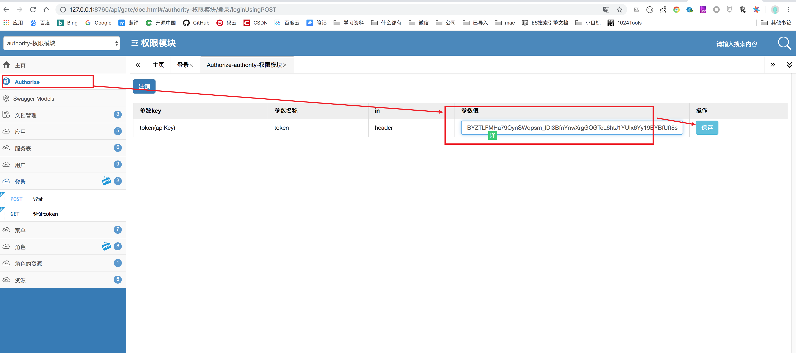
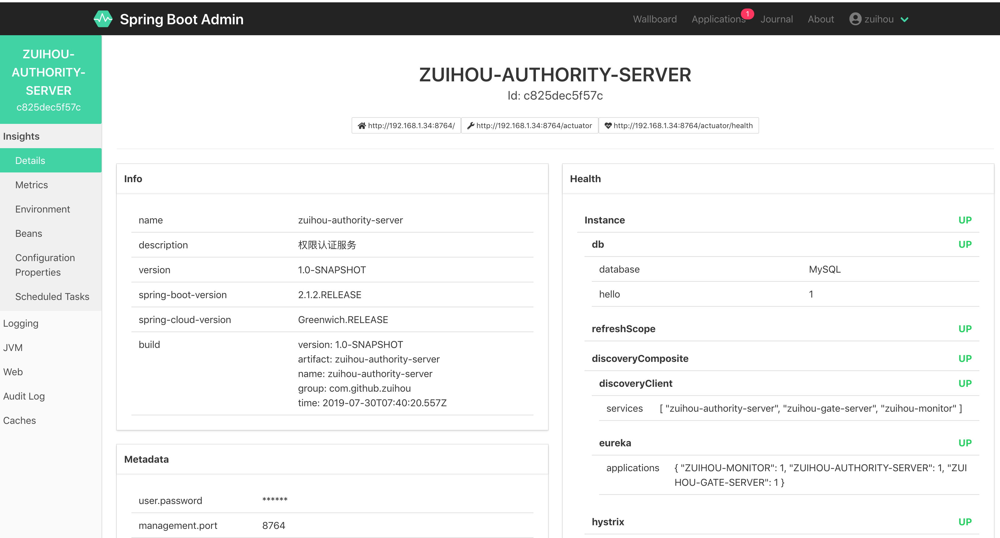

# zuihou-admin-cloud

[](https://github.com/zuihou/zuihou-admin-cloud/blob/master/LICENSE)
[](https://github.com/zuihou/zuihou-admin-cloud)
[](https://github.com/zuihou/zuihou-admin-cloud)
[](https://github.com/zuihou/zuihou-admin-cloud/stargazers)
[](https://gitee.com/zuihou111/zuihou-admin-cloud/stargazers)
[](https://github.com/zuihou/zuihou-admin-cloud/network/members)
[](https://gitee.com/zuihou111/zuihou-admin-cloud/members)


## 简介：
基于`SpringCloud(Greenwich.RELEASE)`  + `SpringBoot(2.1.2.RELEASE)` 的微服务 脚手架，具备用户管理、资源权限管理、网关统一鉴权、Xss防跨站攻击、自动代码生成、多存储系统、分布式事务、分布式定时任务等多个模块，支持多业务系统并行开发，
支持多服务并行开发，可以作为后端服务的开发脚手架。代码简洁，架构清晰，非常适合学习使用。核心技术采用Eureka、Fegin、Ribbon、Zuul、Hystrix、JWT Token、Mybatis、SpringBoot、Seata、Nacos、Sentinel、
RibbitMQ、FastDFS等主要框架和中间件。

希望能努力打造一套从 `基础框架` - `分布式微服务架构` - `持续集成` - `自动化部署` - `系统监测` 的解决方案。`本项目旨在实现基础能力，不涉及具体业务。`

部署方面, 可以采用以下4种方式，并会陆续公布jenkins集合以下3种部署方式的脚本和配置文件：
- IDEA 启动
- jar部署
- docker部署 
- k8s部署

## 如果您觉得有帮助，请点右上角 "Star" 支持一下，谢谢！
## 如果您从这个项目学到了一些技巧，请帮忙发送项目地址给您的好基友，谢谢~😁

master分支已经采用Nacos作为注册/配置中心， 需要eureka版本的代码，移步到 https://gitee.com/zuihou111/zuihou-admin-cloud ，选择 `Greenwich-Eureka` 分支（不在提供升级和维护）。

## 交流群： 63202894
`一键加群` <a target="_blank" href="http://shang.qq.com/wpa/qunwpa?idkey=489800b9d07d017fa0b5104608a4bf755f1f38276b79f0ac5e6225d0d9897efb"></a>


## 项目代码地址
[gitee] https://gitee.com/zuihou111/zuihou-admin-cloud  

[github] https://github.com/zuihou/zuihou-admin-cloud  (由于某种特殊原因，下载代码有时非常慢)

[前端] https://github.com/zuihou/zuihou-admin-ui   

[前端] https://gitee.com/zuihou111/zuihou-admin-ui 

[代码生成器] https://github.com/zuihou/zuihou-generator  (提示缺少 zuihou-generator 包，需要下载该项目，执行编译)

[原型] http://zuihou111.gitee.io/zuihou-admin-rp/

[介绍文档] https://zuihou.github.io/zuihou-admin-cloud/

## 演示地址 (账号密码均为： zuihou/zuihou)       （演示账号没有写权限，只能查询）
[演示环境] http://42.202.130.216:10000/zuihou-ui                （http://wzroom.cn/zuihou-ui 即将到期）      

[注册中心] http://42.202.130.216:10000/nacos/      

[在线文档] http://42.202.130.216:10000/api/gate/doc.html       （http://wzroom.cn/api/gate/doc.html 即将到期）    

[定时任务] http://42.202.130.216:10000/zuihou-jobs-server

[监控中心] http://42.202.130.216:10000/zuihou-monitor/


## 功能点介绍:
 - **服务注册与调用：**

基于Eureka来实现的服务注册与调用，在Spring Cloud中使用Feign, 我们可以做到使用HTTP请求远程服务时能与调用本地方法一样的编码体验，开发者完全感知不到这是远程方法，更感知不到这是个HTTP请求。

 - **服务鉴权:**

通过JWT的方式来加强服务之间调度的权限验证，保证内部服务的安全性。

 - **负载均衡：**

将服务保留的rest进行代理和网关控制，除了平常经常使用的node.js、nginx外，Spring Cloud系列的zuul和rebbion，可以帮我们进行正常的网关管控和负载均衡。其中扩展和借鉴国外项目的扩展基于JWT的Zuul限流插件，方面进行限流。

 - **熔断机制：**

因为采取了服务的分布，为了避免服务之间的调用“雪崩”，采用了Hystrix的作为熔断器，避免了服务之间的“雪崩”。

 - **监控：**

利用Spring Boot Admin 来监控各个独立Service的运行状态；利用turbine来实时查看接口的运行状态和调用频率；通过Zipkin来查看各个服务之间的调用链等。

 - **数据权限**

利用基于Mybatis的DataScopeInterceptor拦截器实现了简单的数据权限

- **优雅的Bean转换**

采用Dozer组件来对 DTO、DO、PO等对象的优化转换

- **前后端统一表单验证**

严谨的表单验证通常需要 前端+后端同时验证， 但传统的项目，均只能前后端各做一次检验， 后期规则变更，又得前后端同时修改。
故在`hibernate-validator`的基础上封装了`zuihou-validator-starter`起步依赖，提供一个通用接口，可以获取需要校验表单的规则，然后前端使用后端返回的规则，
以后若规则改变，只需要后端修改即可。

- **防跨站脚本攻击（XSS）**
- **当前用户信息注入器**
- **在线API**

由于原生swagger-ui某些功能支持不够友好，故采用了国内开源的`swagger-bootstrap-ui`，并制作了stater，方便springboot用户使用。

- **代码生成器**

基于Mybatis-plus-generator自定义了一套代码生成器， 通过配置数据库字段的注释，自动生成枚举类、数据字典注解、SaveDTO、UpdateDTO、表单验证规则注解、Swagger注解等。

- **定时任务调度器**：

基于xxl-jobs进行了功能增强。（如：指定时间发送任务、执行器和调度器合并项目、多数据源）

- **汉化 Eureka 注册中心页面**

- **大文件/断点/分片续传**

前端采用webupload.js、后端采用NIO实现了大文件断点分片续传，启动Eureka、Zuul、File服务后，直接打开docs/chunkUploadDemo/demo.html即可进行测试。
经测试，本地限制堆栈最大内存128M启动File服务,5分钟内能成功上传4.6G+的大文件，正式服耗时则会受到用户带宽和服务器带宽的影响，时间比较长。

- **分布式事务**   
集成了阿里的分布式事务中间件：seata，以 **高效** 并且对业务 **0侵入** 的方式，解决 微服务 场景下面临的分布式事务问题。
   
## 项目架构图:  架构图.xml -> https://www.draw.io/


## 技术栈/版本介绍：
- 所涉及的相关的技术有：
    - JSON序列化:Jackson
    - 消息队列：RibbitMQ
    - 数据库： MySQL 5.7.9 (驱动6.0.6)
    - 定时器：采用xxl-jobs项目进行二次改造
    - 前端：vue 
    - 持久层框架： Mybatis-plus 
    - 代码生成器：基于Mybatis-plus-generator自定义  [https://github.com/zuihou/zuihou-generator.git]
    - API网关：Zuul 
    - 服务注册与发现：Eureka -> Nacos
    - 服务消费：OpenFeign
    - 负载均衡：Ribbon
    - 配置中心：Nacos
    - 服务熔断：Hystrix
    - 项目构建：Maven 3.3
    - 分布式事务： seata
    - 分布式系统的流量防卫兵： Sentinel
    - 文件服务器：FastDFS 5.0.5/阿里云OSS/七牛/本地存储
    - Nginx
- 部署方面：
    - 服务器：CentOS
    - Jenkins
    - Docker 18.09
    - Kubernetes 1.12

本代码采用 Intellij IDEA(2018.1 EAP) 来编写，但源码与具体的 IDE 无关。

PS: Lombok版本过低会导致枚举类型的参数无法正确获取参数，经过调试发现因为版本多低后，导致EnumDeserializer的 Object obj = p.getCurrentValue();取的值为空。

## 感谢：
- swagger-bootstrap-ui
- mybatis-plus
- xxl-jobs
- hutool
- guava
- 等等

## 约定：

- zuihou-xxx-api 模块中提供feign客户端
- 区分po、dto，不要把po中的所有字段都返回给前端。 前端需要什么字段，就返回什么字段
- 类名：首字母大写驼峰规则；方法名：首字母小写驼峰规则；常量：全大写；变量：首字母小写驼峰规则，尽量非缩写
- 业务模块接口层命名为`项目-业务-api`，如`zuihou-authority-api`
- 业务模块业务层命名为`项目-业务-biz`，如`zuihou-authority-biz`
- 业务模块控制层命名为`项目-业务-controller`，如`zuihou-authority-controller`
- 业务模块容器命名为`项目-业务-server`，如`zuihou-authority-server`
- 数据表命名为：`前缀_[模块_]表名`， 模块可有可无， 如`c_auth_role`、 `f_file`
- 注释：
```
表注释： 第一行用简短的文字来描述表的名称，会体现在Swagger中； 换行后对表进行详细介绍
字段注释： 第一行用简短的文字来描述字段的名称，会体现在Swagger的字段描述上； 换行后对字段进行详细的描述。
        另外，若字段需要使用枚举类型，则字段需要设置成varchar类型， 并在字段注释上使用 #枚举类型{KEY:描述;key2:描述;} 格式来描述枚举类型格式， 代码生成器会自动生成枚举类
        eg: #LogType{OPT:操作日志;EX:异常日志;}
类注释： 用 /** 开头的文档型注释， 并添加 @author @date 等参数
方法注释：  用 /** 开头的文档型注释， 并添加 @param @return 等参数
```
- 更多规范，参考[阿里巴巴Java开发手册] https://gitee.com/zuihou111/zuihou-admin-cloud/attach_files

## 小技巧
- 多线程编译： `clean install -T8 -DskipTests=true`
- mapper类上增加注解`@Repository`, 防止`IDEA`提示注入报错。
- IDEA提示`@Autowired`注入失败时，可以用`@Resource` 防止`IDEA`提示注入报错。
- IDEA提交代码时，勾选Reformat code、Rearrange code、Optimize imports, 让代码更整洁

## 期待您的加入：
    1，前端  （急需！！只要你懂点vue、热爱开源，请加入我们的队伍吧）
    2，后端
    3，土豪哥哥(求赞助服务器)
    4，有想要合作或者赞助服务器的朋友加群（63202894）联系群主

## 如何贡献代码    
    1，Fork
    2，修改代码后提交pr
    3，等待合并
    4，合并超过5次的朋友，直接拉为项目开发者
    
## 项目结构:

```
├─zuihou-admin-cloud
│  │  
│  ├─docs-------------------------------------文档
│  │  
│  ├─third-party-----------------------------第三方组件
│  │  
│  ├─zuihou-backend---------------------------后端服务
│  |  ├─zuihou-api----------------------------常用API
│  |  ├─zuihou-authority----------------------权限服务[正在开发]
│  |  |  ├─zuihou-admin-biz-------------------权限服务业务模块
│  |  |  ├─zuihou-admin-controller------------权限服务接口模块
│  |  |  ├─zuihou-admin-entity----------------权限服务实体模块
│  |  |  ├─zuihou-admin-server----------------权限服务启动模块
│  |  ├─zuihou-config-------------------------配置中心
│  |  ├─zuihou-demo---------------------------演示服务
│  |  ├─zuihou-file---------------------------文件模块服务[完成]
│  |  ├─zuihou-gateway------------------------统一网关负载中心
│  |  |  |─zuihou-gateway-server--------------gateway网关启动模块
│  |  |  |─zuihou-zuul-authentication---------zuul网关权限控制模块
│  |  |  |─zuihou-zuul-base-------------------zuul网关公共模块
│  |  |  |─zuihou-zuul-ratelimit--------------zuul网关限流模块
│  |  |  |─zuihou-zuul-server-----------------zuul网关启动模块
│  |  ├─zuihou-jobs---------------------------定时任务调度执行器[完成]
│  |  ├─zuihou-msgs---------------------------消息模块服务[完成]
│  |  ├─zuihou-order--------------------------订单服务
│  │ 
│  ├─zuihou-commons--------------------------公共模块   
│  |  ├─zuihou-cache-starter-----------------缓存模块
│  |  ├─zuihou-common------------------------项目业务模块 （业务模块主要用于存放可能跟业务相关的公共代码）
│  |  ├─zuihou-core--------------------------项目核心模块 （核心模块存放无业务逻辑的公共代码）
│  |  ├─zuihou-databases---------------------项目数据源配置模块
│  |  ├─zuihou-dozer-starter-----------------优雅的bean转换起步依赖
│  |  ├─zuihou-jwt-starter-------------------JWT起步依赖
│  |  ├─zuihou-log-starter-------------------操作日志起步依赖
│  |  ├─zuihou-openfeign-starter-------------OpenFeign常用配置起步依赖
│  |  ├─zuihou-shiro-starter-----------------shiro起步依赖
│  |  ├─zuihou-swagger2-starter--------------SwaggerUI文档配置
│  |  ├─zuihou-user-starter------------------用户信息自动注入起步依赖
│  |  ├─zuihou-validator-starter-------------增强表单前后端统一验证起步依赖
│  |  ├─zuihou-xss-starter-------------------防XSS起步依赖
│  │ 
│  ├─zuihou-dependencies----------------------项目顶级pom
│  │ 
│  ├─zuihou-support---------------------------服务模块
│  |  ├─zuihou-eureka-------------------------注册中心[已废弃]
│  |  ├─zuihou-monitor------------------------spring-boot-admin监控中心[已开发]
│  |  ├─zuihou-zipkin-------------------------zipkin分布式链路跟踪[已废弃]
│  │
│  │-...
```

## 环境须知：

- nginx (文件下载、预览时需要使用)
- mysql 5.7.9+
- JDK8
- IDE插件一个(Eclipse, IDEA都需要安装插件)，`lombok插件`


## 运行步骤: 
- 1, 依次运行数据库脚本(开发阶段，数据库脚本可能更新不及时，有问题github、gitee上留言， 会第一次时间同步)：
    - docs/1_create_schema.sql                  # 创建数据库
    - docs/sql/zuihou_authority_dev.sql         # 导入权限库表结构和数据  (文件名 就是库名)
    - docs/sql/c_common_area.sql                # 向(zuihou_authority_dev库)导入地区表结构和数据  
    - docs/sql/zuihou_file_dev.sql              # 导入文件服务表结构和数据
    - docs/sql/zuihou_jobs_dev.sql              # 导入定时任务库表结构和数据
    - docs/sql/zuihou_msgs_dev.sql              # 导入消息服务表结构和数据    
    - docs/sql/zuihou_demo_dev.sql              # 导入demo服务表结构和数据     

- 2, 启动 nacos，新增命名空间 - `zuihou`，并记录下自己新增的命名空间ID
- 3，将该明空空间ID复制到项目： `zuihou-dependencies/pom.xml` - `<pom.nacos.namespace>你刚才复制的命名ID</pom.nacos.namespace>` ，同时在pom.xml中将nacos的ip和端口修改成自己的。
- 4，在nacos中，点击`配置中心`- 切换到`zuihou` - 导入 zuihou-backend/zuihou-config/src/main/resources 下的所有文件，具体操作看 third-party/README.md
- 5, 在nacos中修改 redis.yml、mysql.yml
- 6, mac/linux 在启动项目之前先创建日志文件夹
```
mkdir -p /data/projects/logs

chown -R $USER:$USER /data/projects/logs     # linux 
chown -R $USER:wheel /data/projects/logs     # mac  
```
- 7， window 在项目启动前，在代码所在的盘创建：D:/data/projects。  如： D:/data/projects
- 8，编译项目：` clean install -DskipTests=true -T8 -P dev -f pom.xml ` (这一步很重要，尤其是在IDEA中启动项目)
- 9，在IDE中启动，编译通过后按如下顺序启动：
    - Nacos                 
    - AuthorityApplication     
    - ZuulServerApplication   
    - FileServerApplication (可选)
    - MsgsServerApplication (可选)
    - JobsServerApplication (可选)
    - MonitorApplication    (可选)
    - 启动seata              (可选，若要测试分布式事务则一定要在nacos启动后，在启动seata-server)(详情参考third-party/README.md)
    - OrderServerApplication (可选)
    - DemoServerApplication (可选)
    - 前端启动，参考 [前端] (https://github.com/zuihou/zuihou-admin-ui?_blank)

- 10， 启动完毕，就可以测试了。每个服务都能访问各自的swagger文档， 然后在网关有一个聚合文档（能看到所有服务的接口）。

访问：  http://127.0.0.1:8760/api/gate/doc.html ，切换（左上角）到 `authority-权限模块`  -  `登录` - `登录` 输入账号密码(`zuihou/zuihou`) 用于生成token

然后将token复制到 `Authorize` - 填到 token 的value 框， 保存后刷新一下页面， 然后调用其他接口即能正确传递token到后端。

开发小技巧： 这里token 有一个默认值`test` ，用于开发环境测试时使用 （详见：TokenContextFilter）。

```
# 注意： swagger 文档 只能用谷歌浏览器打开！！！ 只能用谷歌浏览器打开！！！只能用谷歌浏览器打开！！！
权限服务： http://127.0.0.1:8764/doc.html
文件服务:  http://127.0.0.1:8765/doc.html
消息服务： http://127.0.0.1:8768/doc.html
网关：    http://127.0.0.1:8760/api/gate/doc.html
定时：    http://127.0.0.1:8767/zuihou-jobs-server/toLogin
```



## 端口号介绍 :

| 服务 | 端口号 |
|:----:|:----:|
| zuihou-eureka | 8761 |  ​
| zuihou-zipkin | 8767 |  ​ 
| zuihou-monitor | 8762,8763 |  ​
| - | - |​- | ​
| zuihou-gateway-server | 8760 |  ​
| zuihou-authority-server | 8764 |  ​
| zuihou-file-server | 8765 |  ​
| zuihou-msgs-server | 8766 |  ​
| zuihou-jobs-server | 8767/8768 |  ​
| zuihou-demo-server | 8769 |  ​
| zuihou-order-server | 8779 |  ​


## 项目截图：
spring-boot-admin监控界面:

spring-boot-admin监控界面:

API 界面:

注册中心界面:

定时任务调度界面:


## 常见问题：
 - 1, 很多依赖死活都下载不下来？
    - 答： 由于spring-boot和spring-cloud等版本比较新，所以目前国内的一些仓库还没有新版本的jar。
    需要配置spring的maven仓库。 （配置后还是无法下载，就先注释掉settings.xml中其他的仓库，只保留这个）
```
    <mirror>
        <id>spring-milestones</id>
        <name>Spring Milestones</name>
        <url>https://repo.spring.io/libs-milestone</url>
        <mirrorOf>central</mirrorOf>
    </mirror>
```
 - 2, 很多类缺少get/set方法？
    - 答：请用IDEA或Eclipse安装`lombok`插件
    
 - 3, zuihou-generator jar缺失？
    - 答： https://github.com/zuihou/zuihou-generator 。去我github下载这个项目，自行编译。
    
 - 4, 为啥要将调度器和执行器合并在一起？
     - 答： 对于中小型项目，对高可用的需求并不是很大，若把调度器和执行器分开部署，会增加部署成本。    
 
 - 5, 将配置文件导入到nacos后，启动解析文件报错？
    - 答： 将配置文件中的所有注释，以及中文删除改成英文
    
 - 6， 启动zuihou-jobs-server报找不到表的错， 但数据库中确实有表，只是表名全是小写？    
    - 答： 1） SHOW VARIABLES LIKE '%case%'; 查看 lower_case_table_names 是否=2  
            2） 修改my.cnf(my.ini) 文件增加  ：
       ```
      [mysqld]
      lower_case_table_names=2
      ```     


## 查看磁盘空间占用
df -h
## 查看当前目录的磁盘占用
du -ah --max-depth=1
     
## 写在最后：
    本项目正在开发阶段，由于码主白天要上班，只有晚上、周末能挤点时间来敲敲代码，所以进度可能比较慢，文档、注释也不齐全。 
    各位大侠就将就着看，但随着时间的推移。文档，注释，启动说明等码主我一定会补全的（对自己负责，也是对大家负责）。   
