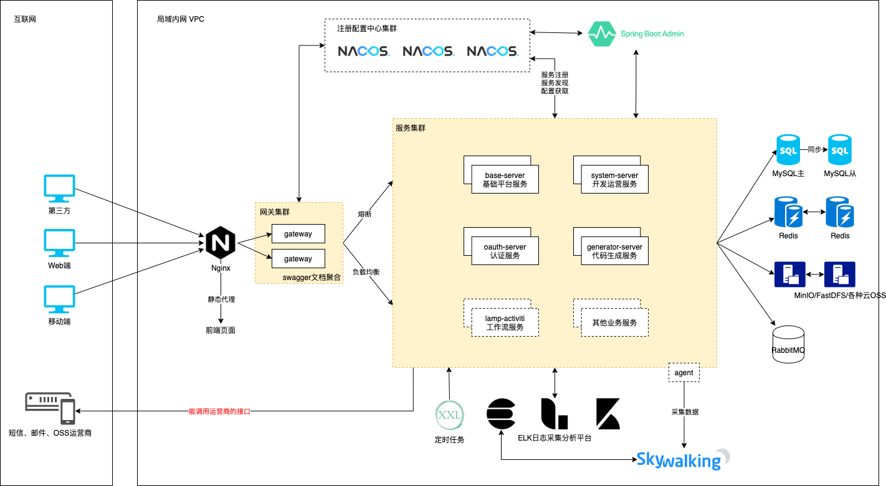
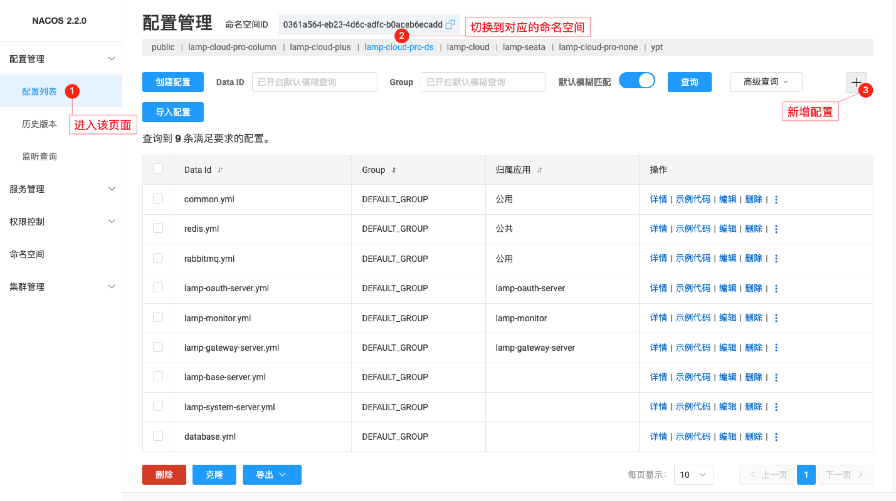
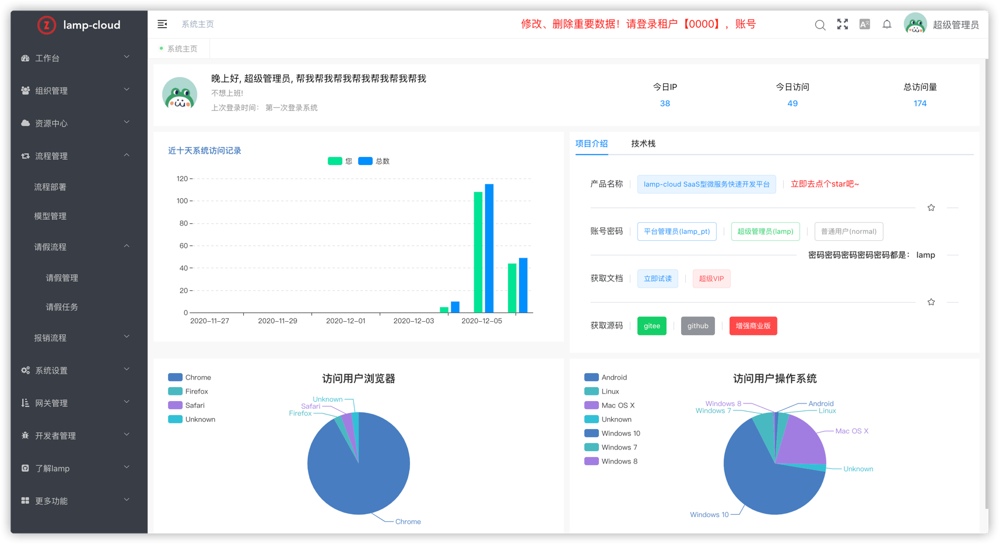
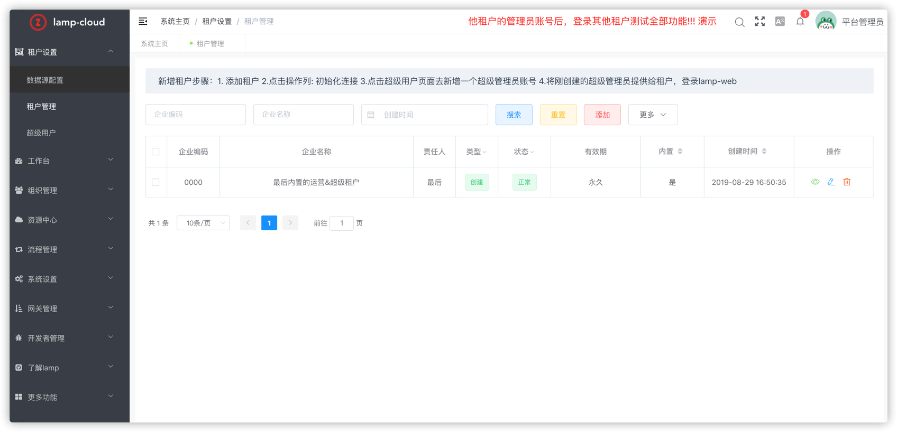
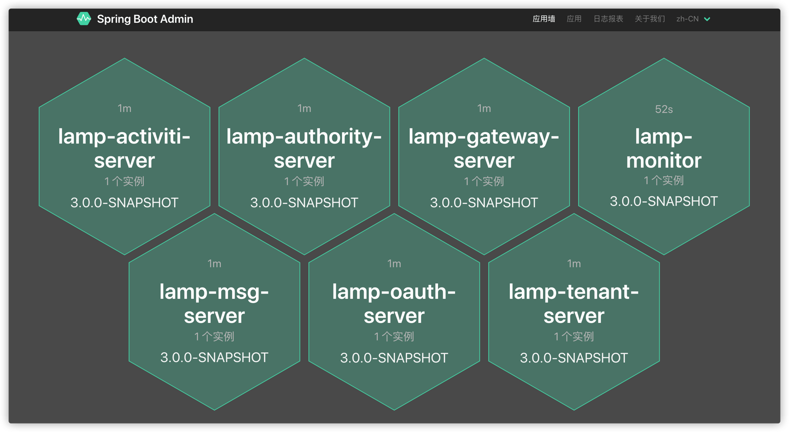
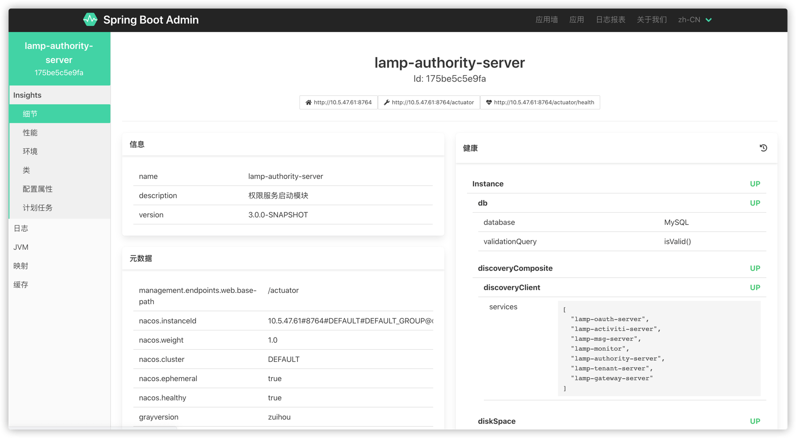

# lamp 快速开发平台

# lamp 项目名字由来
`灯灯`(简称灯， 英文名：lamp)，他是一个项目的统称，由"工具集"、"后端"、"前端"组成，包含以下几个子项目

[点我了解项目详细介绍](简介.md)

## 工具集

| 项目 | gitee | github | 备注 |
| --- | --- | --- | --- |
| lamp-util | [lamp-util](https://gitee.com/zuihou111/lamp-util) | [lamp-util](https://github.com/zuihou/lamp-util) | 核心工具集 |
| lamp-generator | [lamp-generator](https://gitee.com/zuihou111/lamp-generator) | [lamp-generator](https://github.com/zuihou/lamp-generator) | 代码生成器 |
| lamp-job | [lamp-job](https://gitee.com/zuihou111/lamp-job) | [lamp-job](https://github.com/zuihou/lamp-job) | 分布式定时调度器 |

## 后端

| 项目 | gitee | github | 备注 |
| --- | --- | --- | --- |
| lamp-cloud | [lamp-cloud](https://gitee.com/zuihou111/lamp-cloud) |  [lamp-cloud](https://github.com/zuihou/lamp-cloud) | SpringCloud(微服务)版 |
| lamp-boot | [lamp-boot](https://gitee.com/zuihou111/lamp-boot) |  [lamp-boot](https://github.com/zuihou/lamp-boot) | SpringBoot(单体)版 |
| 微服务版示例 | [lamp-samples](https://github.com/zuihou/lamp-samples) | [lamp-samples](https://github.com/zuihou/lamp-samples) | 常用示例 |

## 前端

| 项目 | gitee | github | 备注 | 演示地址 |
| --- | --- | --- | --- | --- |
| lamp-web-plus(强烈推荐！👏👏👏) | [lamp-web-plus](https://gitee.com/zuihou111/lamp-web-plus) | [lamp-web-plus](https://github.com/zuihou/lamp-web-plus) | 基于 vue-vben-admin （vue 3 + ant design vue 2） | https://tangyh.top |
| lamp-web | [lamp-web](https://gitee.com/zuihou111/lamp-web) | [lamp-web](https://github.com/zuihou/lamp-web) | 基于 vue-admin-element (element-ui) | https://tangyh.top/lamp-web |
| lamp-web-beautiful(停更) | [lamp-web-beautiful](https://gitee.com/zuihou111/lamp-web-beautiful) | [lamp-web-beautiful](https://github.com/zuihou/lamp-web-beautiful) | 基于 vue-admin-beautiful | 无 |

# lamp-cloud 简介

`lamp-cloud`只是`lamp`项目的其中一个项目，她基于`jdk11/jdk8` + `SpringCloud(Hoxton.SR10)`  + `SpringBoot(2.3.10.RELEASE)` 开发，
她是一个微服务中后台快速开发平台，可以通过插件无缝切换是否启用SaaS模式、通过配置切换SaaS模式采用独立数据库模式还是字段模式。

她具备SaaS模式切换、完备的RBAC功能、网关统一鉴权、灰度发布、数据权限、可插拔缓存、统一封装缓存的key、表单校验前后端统一验证、字典数据自动回显、Xss防跨站攻击、自动生成前后端代码、多种存储系统、分布式事务、分布式定时任务等多个功能和模块，
支持多业务系统并行开发， 支持多服务并行开发，是中后台系统开发脚手架的最佳选择。代码简洁，注释齐全，架构清晰，非常适合学习和企业作为基础框架使用。

核心技术采用Spring Cloud Alibaba、SpringBoot、Mybatis、Seata、Sentinel、RabbitMQ、FastDFS/MinIO、SkyWalking等主要框架和中间件。
希望能努力打造一套从 `Web基础框架` - `分布式微服务架构` - `持续集成` - `系统监测` 的解决方案。本项目旨在实现基础框架能力，不涉及具体业务。

# 会员版演示地址
- 后端使用lamp-cloud-plus，前端使用lamp-web-plus。演示地址： https://tangyh.top
- 后端使用lamp-cloud-plus，前端使用lamp-web。演示地址： https://tangyh.top/lamp-web
- 后端使用lamp-boot-plus， 前端使用lamp-web-plus。演示地址： https://boot.tangyh.top
- 后端使用lamp-boot-plus， 前端使用lamp-web。演示地址： https://boot.tangyh.top/lamp-web

# 演示账号
- 以下内置账号仅限于内置的0000租户
- 平台管理员： lamp_pt/lamp (内置给公司内部运营人员使用)
- 超级管理员： lamp/lamp
- 普通管理员： general/lamp
- 普通账号： normal/lamp

# 快速上手
- 入门到精通，参考文档： https://www.kancloud.cn/zuihou/zuihou-admin-cloud
- 发现bug和建议，请提交issue： https://github.com/zuihou/lamp-cloud/issues
- 常见问题，请参考Discussions： https://github.com/zuihou/lamp-cloud/discussions

# 项目截图：

| 预览 | 预览 |
|---|---|
|  |  |
|  |  |
|  |  |
|  |  |
|  |  |
|  |   |
|  |  |

# 会员版
本项目分为开源版和会员版，github和gitee上能搜索到的为开源版本，遵循Apache协议。 会员版源码在私有gitlab托管，购买后开通账号。

会员版和开源版区别请看：[会员版](会员版.md)

