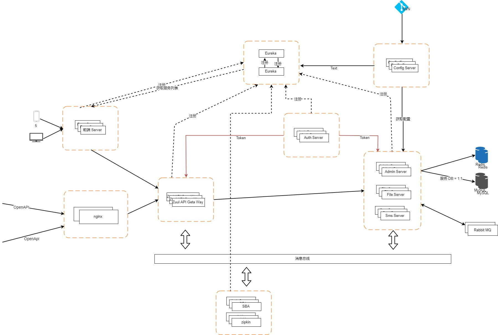
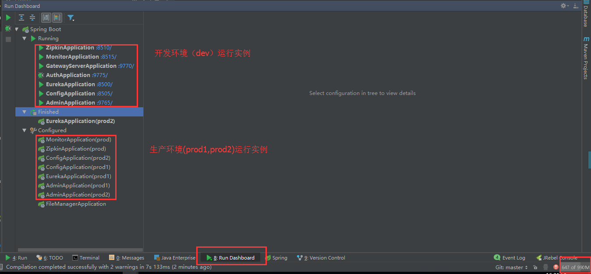
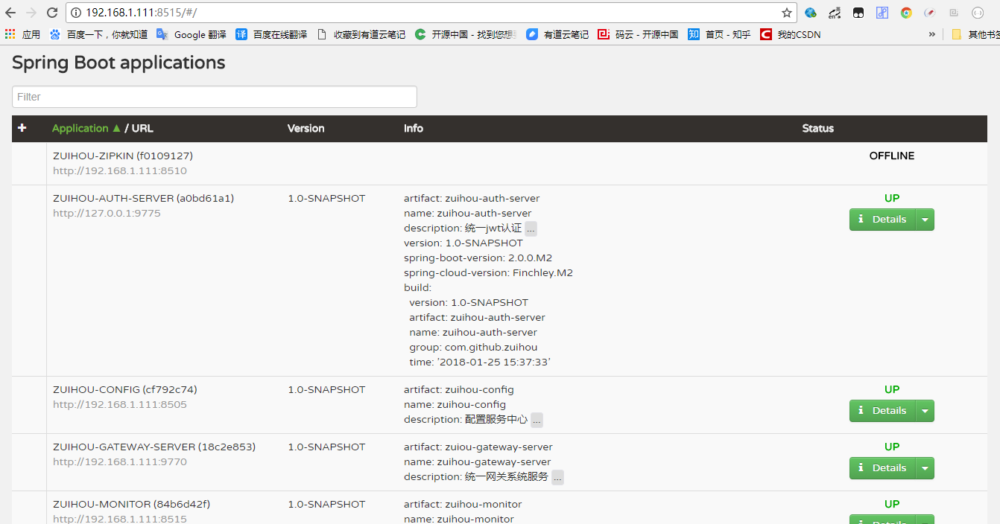
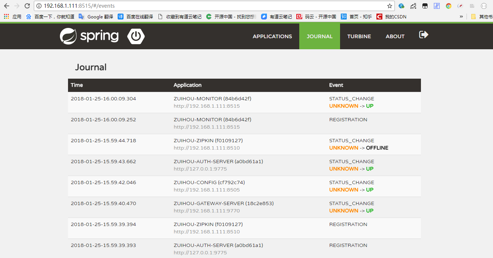
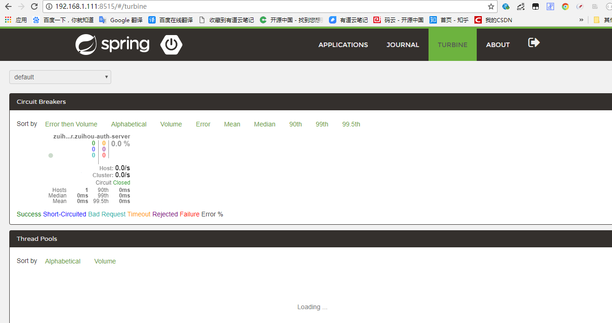
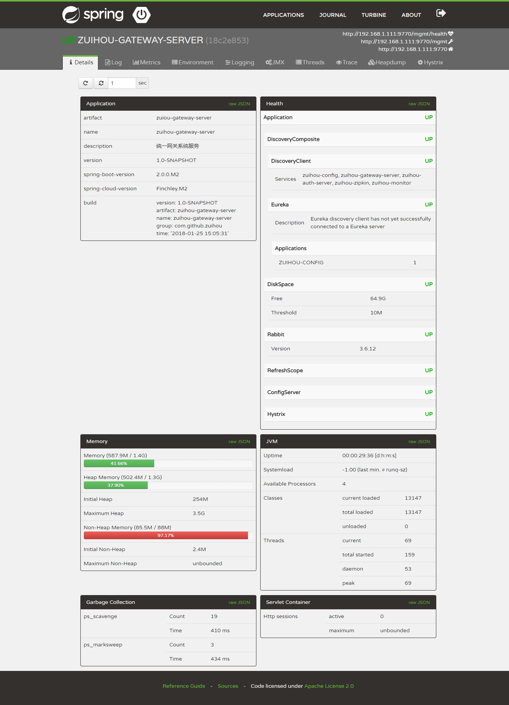
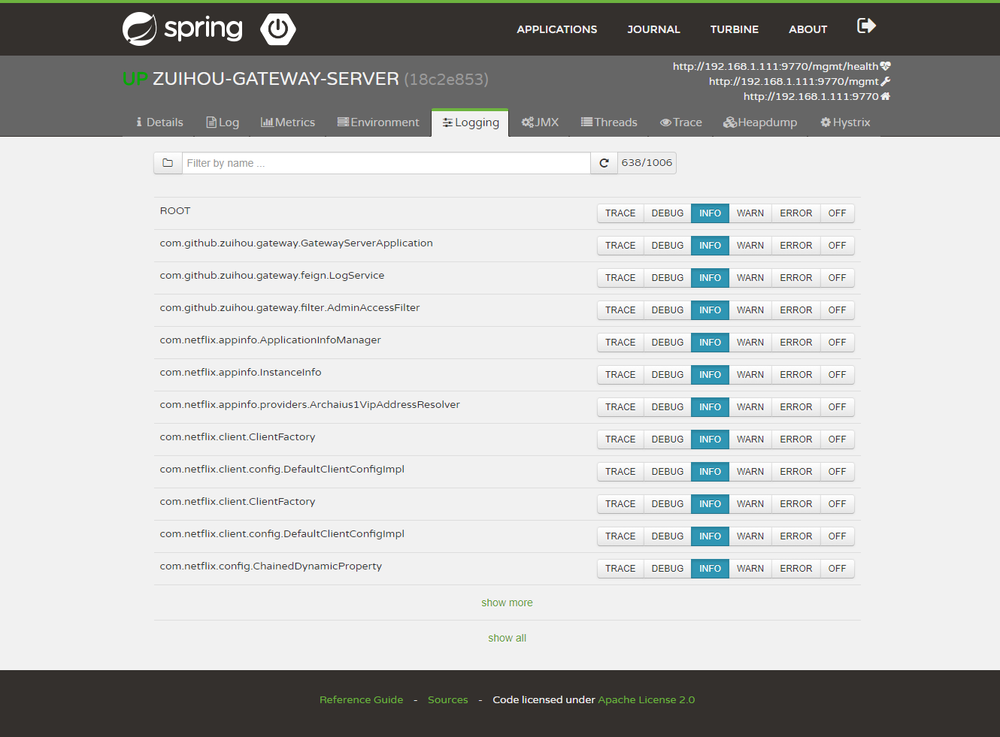
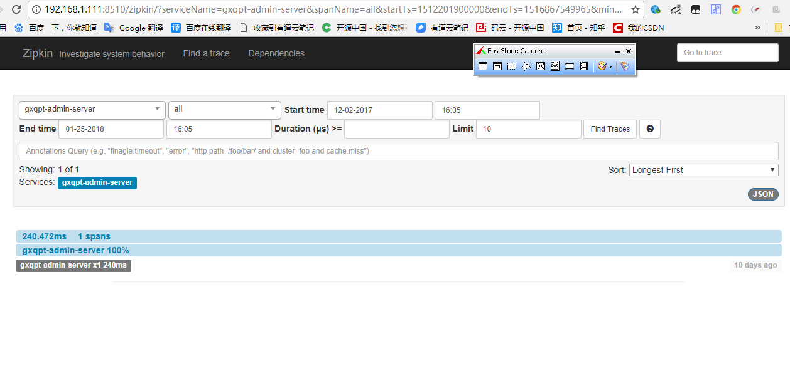
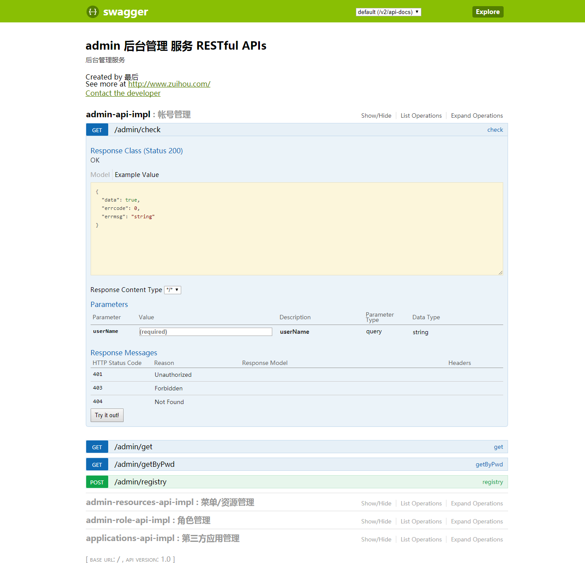

# zuihou-admin-cloud

 测试 Edgware　相关功能

## 简介：
基于`SpringCloud(Edgware.RELEASE)`  + `SpringBoot(1.5.9.RELEASE)` 的微服务 SaaS 开发平台，
具有统一授权、认证后台管理系统，其中包含具备用户管理、配置中心、存储系统、资源权限管理、
网关API、OpenAPI管理、日志分析、任务和通知等多个模块，
支持多服务并行开发，可以作为后端服务的开发脚手架。代码简洁，架构清晰，非常适合学习使用。
核心技术采用Eureka、Fegin、Ribbon、Zuul、Hystrix、JWT Token、Mybatis、SpringBoot、Redis、
RibbitMQ、FastDFS等主要框架和中间件。

希望能努力打造一套从 `基础框架` - `分布式微服务架构` - `持续集成` - 
`自动化部署` - `系统监测` 的解决方案。

该项目为本人在学习过程中通过一些`其他的开源项目`，`资料`，`文章`进行整合的一个提供基础功能的项目。`本项目旨在实现基础能力，不设计具体业务。`
目前国内的一些资料讲解和使用的SpringCloud版本都比较低，自己在基于现有的开源项目和资料学习的同时，
一边以自己的一些想法改造搭建一个相对较新版本的项目。

后期会引入`Docker`（慢慢学，还没到这一步）

## 项目地址
[github] https://github.com/zuihou/zuihou-admin-cloud
[gitee] https://gitee.com/zuihou111/zuihou-admin-cloud

## 架构详解:
 - 服务注册与调用：

基于Eureka来实现的服务注册与调用，在Spring Cloud中使用Feign, 我们可以做到使用HTTP请求远程服务时能与调用本地方法一样的编码体验，开发者完全感知不到这是远程方法，更感知不到这是个HTTP请求。

 - 服务鉴权:

通过JWT的方式来加强服务之间调度的权限验证，保证内部服务的安全性。

 - OpenAPI鉴权：

通过JWT的方式来加强对外暴露接口调度的权限验证，保证api接口的安全性。

 - 负载均衡：

将服务保留的rest进行代理和网关控制，除了平常经常使用的node.js、nginx外，Spring Cloud系列的zuul和rebbion，可以帮我们进行正常的网关管控和负载均衡。其中扩展和借鉴国外项目的扩展基于JWT的Zuul限流插件，方面进行限流。


 - 熔断机制：

因为采取了服务的分布，为了避免服务之间的调用“雪崩”，采用了Hystrix的作为熔断器，避免了服务之间的“雪崩”。

 - 监控：

利用Spring Boot Admin 来监控各个独立Service的运行状态；利用turbine来实时查看接口的运行状态和调用频率；通过Zipkin来查看各个服务之间的调用链等。

## 项目架构图


## 技术栈/版本介绍：
- 所涉及的相关的技术有 ：
    - JSON序列化:Jackson
    - 缓存：Redis 3.0.500（待升级 4.0.6）
    - 消息队列：RibbitMQ
    - 数据库： MySQL 5.7.9(驱动6.0.6)
    - 定时器：Quartz Scheduler
    - Java模版：Thymeleaf  3.0.6.RELEASE
    - 前端：Bootstrap + Vue2.0 （期待前端大神参与）
    - API网关：Zuul 
    - 服务注册与发现：Eureka 
    - 服务消费：Ribbon、OpenFeign
    - 负载均衡：Ribbon
    - 配置中心：Config Server  （git）
    - 服务熔断：Hystrix
    - 项目构建：Maven 3.3
    - 文件服务器：FastDFS 5.0.5
    - 服务器：centos
- 后期引入：
    - Docker
    - Jenkins
    - nginx
    - keepalive

本代码采用 Intellij IDEA(2018.1 EAP) 来编写，但源码与具体的 IDE 无关。

## 约定：

- zuihou-xxx-api 项目中提供feign客户端，dto
- 区分po、dto，不要把po中的所有字段都返回给前端。 前端需要什么字段，就返回什么字段
- 类名：首字母大写驼峰规则；方法名：首字母小写驼峰规则；常量：全大写；变量：首字母小写驼峰规则，尽量非缩写
- 业务模块接口层命名为`项目`-`业务-api`，如`zuihou-admin-api`
- 业务模块业务层命名为`项目`-`业务-repository`，如`zuihou-admin-repository`
- 业务模块容器命名为`项目`-`业务-server`，如`zuihou-admin-server`
- 监控模块命名为`项目`-`业务`，如`zuihou-admin`
- 数据表命名为：`子系统`_`表`，如`b_role`
- 更多规范，参考[阿里巴巴Java开发手册] https://gitee.com/zuihou111/zuihou-admin-cloud/attach_files


## 期待您的加入：
    1，前端哥哥
    2，后端哥哥
    3，土豪哥哥(求赞助服务器)
    4，小姐姐

## 启动指南

## 环境须知：

- nginx (暂时没用到)
- mysql ，redis ，rabbitmq
- jdk1.8
- IDE插件一个(Eclipse, IDEA都需要安装插件)，`lombok插件`

## 项目结构:

```
├─zuihou-admin-cloud
│  │  
│  ├─zuihou-backend---------------------------后端服务
│  |  ├─zuihou-admin--------------------------后端管理服务
│  |  |  ├─zuihou-admin-api------------------后端管理服务api接口
│  |  |  ├─zuihou-admin-repository------------后端管理业务/持久层
│  |  |  ├─zuihou-admin-server----------------后端管理服务
│  |  |─zuihou-base---------------------------基础模块服务
│  |  |  ├─zuihou-base-api-------------------基础模块接口/dto
│  |  |  ├─zuihou-base-repository-------------基础模块业务/持久层
│  |  |  ├─zuihou-base-server-----------------基础模块服务
│  |  ├─zuihou-file---------------------------文件模块服务
│  |  ├─zuihou-mail---------------------------邮件模块服务
│  |  ├─zuihou-sms----------------------------短信模块服务
│  |  ├─zuihou-auth---------------------------鉴权中心
│  |  |  |─zuihou-auth-client-----------------鉴权中心客户端
│  |  |  |─zuihou-auth-common-----------------鉴权中心公共包
│  |  |  |─zuihou-auth-server-----------------鉴权中心服务
│  |  ├─zuihou-gateway------------------------统一网关负载中心
│  |  |  |─zuihou-gateway-ratelimit-----------网关限流插件
│  |  |  |─zuihou-gateway-server--------------项目网关服务
│  │ 
│  ├─zuihou-common----------------------------公共模块（这里一直没想好怎么调整，有想法的朋友可以给我留言）
│  |  ├─zuihou-commons------------------------项目公共包
│  |  ├─zuihou-core---------------------------项目核心包
│  │ 
│  ├─zuihou-frontend--------------------------项目前端
│  |  ├─zuihou-center-web----------------------项目前端
│  |  ├─zuihou-sso-client---------------------项目单点登录client
│  │
│  ├─zuihou-config-repo-----------------------远程配置文件仓库
│  │
│  ├─zuihou-service---------------------------服务模块
│  |  ├─zuihou-config-------------------------配置中心
│  |  ├─zuihou-eureka-------------------------注册中心
│  |  ├─zuihou-monitor------------------------spring-boot-admin监控中心
│  |  ├─zuihou-zipkin-------------------------zipkin分布式链路跟踪
│  │
│  │-...
```

## 运行步骤: 
 接下来分别介绍开发环境(dev)和正式环境(prod1,prod2)的运行步骤. 
 生产环境所有服务单例运行，生产环境所有服务运行2个实例（除了zuihou-monitor,zuihou-zipkin.这2个监控服务）

### 开发环境
- 1, 开发环境(dev)Hosts文件配置：
```
127.0.0.1 casserver.zuihou.com
127.0.0.1 eureka.zuihou.com
127.0.0.1 config.zuihou.com
127.0.0.1 admin.zuihou.com
127.0.0.1 base.zuihou.com
127.0.0.1 gateway.zuihou.com
127.0.0.1 auth.zuihou.com
127.0.0.1 monitor.zuihou.com
127.0.0.1 zipkin.zuihou.com zuihou-zipkin

127.0.0.1 zuihou.rabbitmq.host
127.0.0.1 zuihou.mysql.host
127.0.0.1 zuihou.redis.host
```
- 2, 依次运行数据库脚本：
    - doc/sql/zuihou_admin_dev.sql

- 3, 通过以下方法，进行密码加密：
```
    public static void main(String[] args) throws Exception {
        System.out.println(ConfigTools.encrypt("your mysql password"));
    }
```
- 4, 修改配置数据库/redis/rabbitMQ配置：
    - （画重点）修改配置需要各位自己在github或者gitee上创建自己的仓库，但目录结构需要和`zuihou-config-repo`的结构一致，
      然后在修改`zuihou-config`服务`application.yml`中的`spring.cloud.config.server.git.uri:`项。（画重点）
    - 理论上只需根据自己的需求修改端口、帐号、密码。 ip 尽量采用虚拟域名，统一修改hosts文件。
    - zuihou-config-repo/zuihou-backend/zuihou-admin-server/application-dev.yml
    - zuihou-config-repo/zuihou-backend/zuihou-gateway-server/application-dev.yml
    - zuihou-config-repo/zuihou-backend/zuihou-auth-server/application-dev.yml
    - zuihou-config-repo/zuihou-backend/zuihou-base-server/application-dev.yml     # 待开发
    - zuihou-config-repo/zuihou-backend/zuihou-file-server/application-dev.yml     # 待开发
    - zuihou-config-repo/zuihou-backend/zuihou-mail-server/application-dev.yml     # 待开发
    - zuihou-config-repo/zuihou-backend/zuihou-sms-server/application-dev.yml      # 待开发

    - zuihou-config-repo/zuihou-service/zuihou-zipkin/application-dev.yml
    - zuihou-config-repo/zuihou-service/zuihou-monitor/application-dev.yml

- 5， 在IDE中启动：
- 5.1， 在IDE中启动：编译代码，修改启动参数：
    - 以IDEA为例， Eclipse 请自行意淫 (图片看不清，请看doc/image/**)
    - 启动配置.png)
    - 启动配置.png)
    - 启动配置.png)
    - 启动配置.png)
    - 这里只演示其中几个服务， 剩余的服务，按照相同的方法配置
    - 最终运行实例: 
- 5.2，按`顺序`运行main类：
    - EurekaApplication（zuihou-eureka）  # 第一步
    - ConfigApplication（zuihou-config）  # 第二步
    - AdminServerApplication（zuihou-admin-server）  #下面的顺序无所谓
    - AuthApplication（zuihou-auth-server）
    - GatewayServerApplication（zuihou-gateway-server）
    - MonitorApplication（zuihou-monitor）
    - ZipkinApplication（zuihou-zipkin）

- 6， 命令行启动:
    - 先cd 到各个服务的target目录，依次启动即可：
    - java -jar -Dspring.profiles.active=dev zuihou-eureka.jar 
    - java -jar -Dspring.profiles.active=dev zuihou-config.jar 
    - java -jar -Dspring.profiles.active=dev zuihou-***.jar  

### 生产环境 

- 1, 生产环境(prod1,prod2)Hosts文件配置：
```
127.0.0.1 casserver.zuihou.com
127.0.0.1 eureka1.zuihou.com eureka2.zuihou.com
127.0.0.1 config1.zuihou.com config2.zuihou.com  
127.0.0.1 admin1.zuihou.com admin2.zuihou.com
127.0.0.1 base1.zuihou.com base2.zuihou.com
127.0.0.1 gateway1.zuihou.com gateway2.zuihou.com
127.0.0.1 auth1.zuihou.com auth2.zuihou.com
127.0.0.1 monitor.zuihou.com
127.0.0.1 zipkin.zuihou.com zuihou-zipkin

127.0.0.1 zuihou.rabbitmq.host
127.0.0.1 zuihou.mysql.host
127.0.0.1 zuihou.redis.host
```

- 2, 依次运行数据库脚本：
    - doc/sql/zuihou_admin_prod.sql  (数据库，redis，rabbitmq 暂时不考虑高可用)

- 3, 通过以下方法，进行密码加密：
```
    public static void main(String[] args) throws Exception {
        System.out.println(ConfigTools.encrypt("your mysql password"));
    }
```

- 4, 修改配置数据库/redis/rabbitMQ配置：
    - 理论上只需根据自己的需求修改端口、帐号、密码。 ip 尽量采用虚拟域名，统一修改hosts文件。
    - prod1 代表实例1  prod2 代表实例2 ， 实例1和实例2 的启动端口根据自己的情况进行修改，但最好跟我的保持一致

    - zuihou-config-repo/zuihou-backend/zuihou-admin-server/application-prod*.yml
    - zuihou-config-repo/zuihou-backend/zuihou-gateway-server/application-prod*.yml
    - zuihou-config-repo/zuihou-backend/zuihou-auth-server/application-prod*.yml
    - zuihou-config-repo/zuihou-backend/zuihou-base-server/application-prod*.yml     # 待开发
    - zuihou-config-repo/zuihou-backend/zuihou-file-server/application-prod*.yml     # 待开发
    - zuihou-config-repo/zuihou-backend/zuihou-mail-server/application-prod*.yml     # 待开发
    - zuihou-config-repo/zuihou-backend/zuihou-sms-server/application-prod*.yml      # 待开发

    - zuihou-config-repo/zuihou-service/zuihou-zipkin/application-prod*.yml
    - zuihou-config-repo/zuihou-service/zuihou-monitor/application-prod*.yml


- 5， 在IDE中启动：
- 5.1， 在IDE中启动：编译代码，修改启动参数：
    - 以IDEA为例， Eclipse 请自行意淫 (图片看不清，请看doc/image/**)
    - 启动配置.png)
    - 启动配置.png)
    - 启动配置.png)
    - 这里只演示其中几个服务， 剩余的服务，按照相同的方法配置

- 5.2，按`顺序`运行main类：
    - EurekaApplication（zuihou-eureka）  # 第一步
    - ConfigApplication（zuihou-config）  # 第二步
    - AdminServerApplication（zuihou-admin-server）  #下面的顺序无所谓
    - AuthApplication（zuihou-auth-server）
    - GatewayServerApplication（zuihou-gateway-server）
    - MonitorApplication（zuihou-monitor）
    - ZipkinApplication（zuihou-zipkin）

- 6， 命令行启动:
    - 先cd 到各个服务的target目录，依次启动即可：
    - java -jar -Dspring.profiles.active=prod1 zuihou-eureka.jar 
    - java -jar -Dspring.profiles.active=prod2 zuihou-eureka.jar 
    - java -jar -Dspring.profiles.active=prod1 zuihou-config.jar 
    - java -jar -Dspring.profiles.active=prod2 zuihou-config.jar 
    - java -jar -Dspring.profiles.active=prod zuihou-monitor.jar    # 这2个是监控服务，暂时不部署多实例(别问为什么，运行太多屌丝机器吃不消)          
    - java -jar -Dspring.profiles.active=prod zuihou-zipkin.jar     # 这2个是监控服务，暂时不部署多实例(别问为什么，运行太多屌丝机器吃不消) 
    - java -jar -Dspring.profiles.active=prod1 zuihou-***.jar  
    - java -jar -Dspring.profiles.active=prod2 zuihou-***.jar  


## 端口号介绍（dev）:

| 服务 | 端口号 |
|:----:|:----:|
| zuihou-eureka | 8500 |  ​
| zuihou-config | 8505 |  ​
| zuihou-zipkin | 8510 |  ​ 
| zuihou-monitor | 8515,8516 |  ​
| - | - |​- | ​
| zuihou-auth-server | 9775 |  ​
| zuihou-gateway-server | 9770 |  ​
| zuihou-admin-server | 9765 |  ​
| zuihou-base-server | 9760 |  ​
| zuihou-file-server | 9755 |  ​
| zuihou-sms-server | 9750 |  ​
| zuihou-email-server | 9745 |  ​

- 端口号介绍（prod）:

| 服务 | 端口号1 | 端口号2 |
|:----:|:----:|:----:|
| zuihou-eureka | 8501 | 8502 | ​
| zuihou-config | 8506 | 8507 | 
| zuihou-zipkin | 8511 | 8512 |
| zuihou-monitor | 8515,8516 | 8517,8518 |  ​
| - | - |​- |
| zuihou-auth-server | 9776 | 9777 |  ​
| zuihou-gateway-server | 9771 | 9772 | 
| zuihou-admin-server | 9766 | 9767 |  ​
| zuihou-base-server | 9761 | 9762 |  ​
| zuihou-file-server | 9756 | 9757 |  ​
| zuihou-sms-server | 9751 | 9752 | ​​
| zuihou-email-server | 9746 | 9747 | ​​

## 项目截图：
spring-boot-admin监控界面:

spring-boot-admin监控界面:

spring-boot-admin监控界面:

spring-boot-admin监控界面:

spring-boot-admin监控界面:

zipkin监控界面:

zipkin监控界面:

API 界面:

注册中心界面:


## 常见报错：
 - 1，找不到fastdfs-client-java(1.27-SNAPSHOT) jar？
    - 答： 去附件(gitee)列表自行下载后安装到仓库即可
 - 2, 很多依赖死活都下载不下来？
    - 答： 由于spring-boot和spring-cloud等版本比较新，所以目前国内的一些仓库还没有新版本的jar。
    需要配置spring的maven仓库。 （配置后还是无法下载，就先注释掉settings.xml中其他的仓库，只保留这个）
``` 
    <mirror>
        <id>spring-milestones</id>
        <name>Spring Milestones</name>
        <url>https://repo.spring.io/libs-milestone</url>
        <mirrorOf>central</mirrorOf>
    </mirror>
```
 - 3, 很多类缺少get/set方法？
    - 答：请用IDEA或Eclipse安装`lombok`插件
    
## 写在最后：
    本项目正在开发阶段，由于码主白天要上班，只有晚上、周末能挤点时间来敲敲代码，所以进度可能比较慢，文档、注释也不齐全。 
    各位大侠就将就着看，但随着时间的推移。文档，注释，启动说明等码主我一定会补全的（对自己负责，也是对大家负责）。   