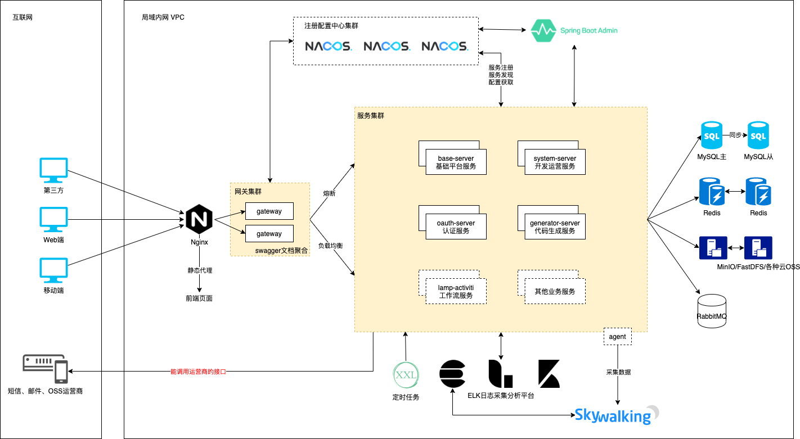
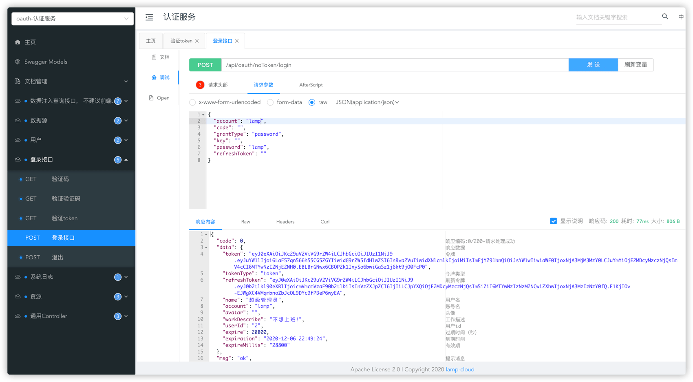
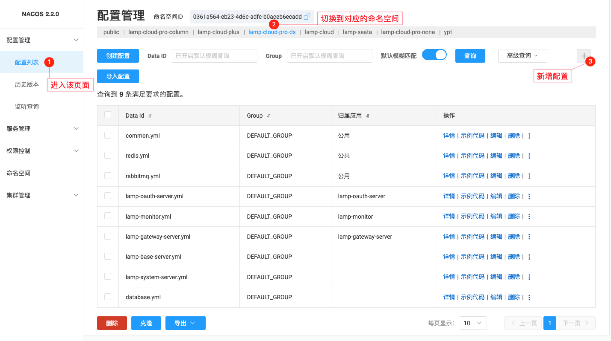
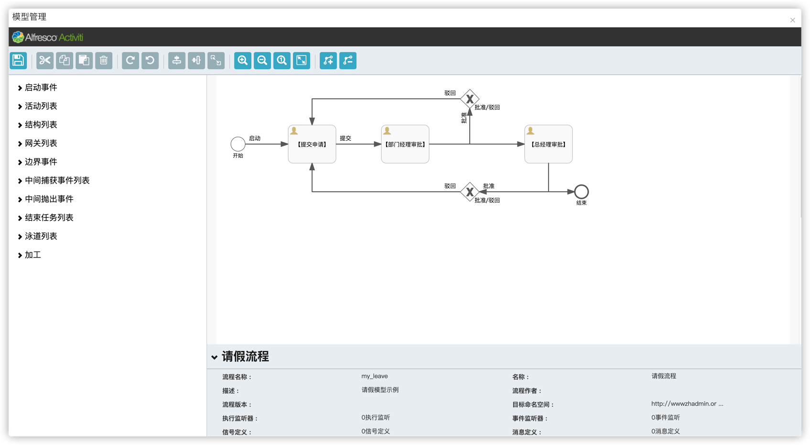
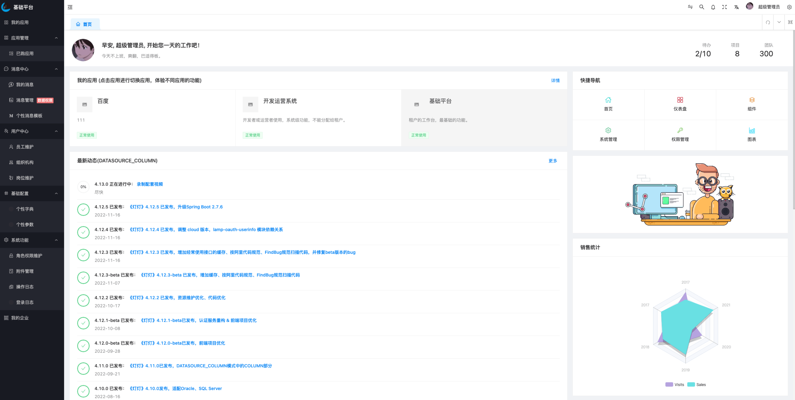
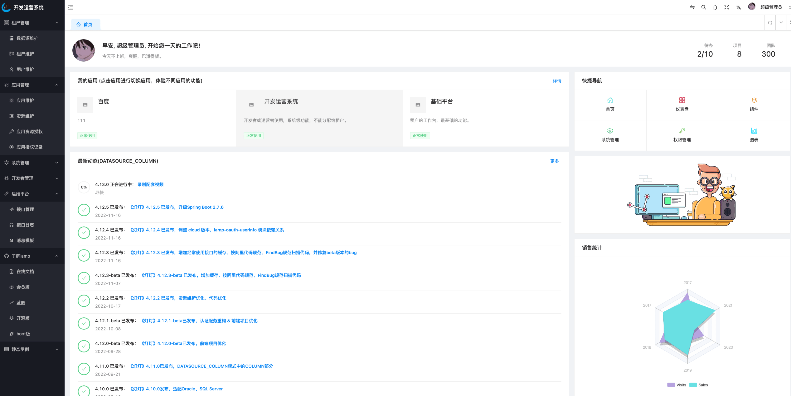
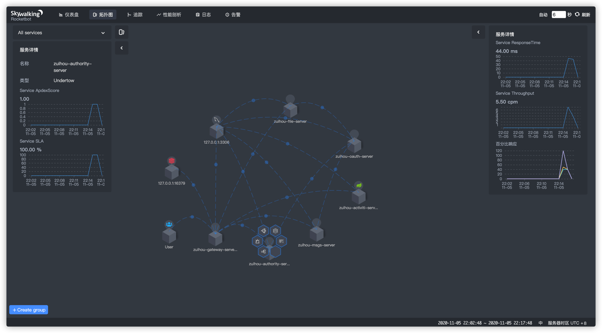
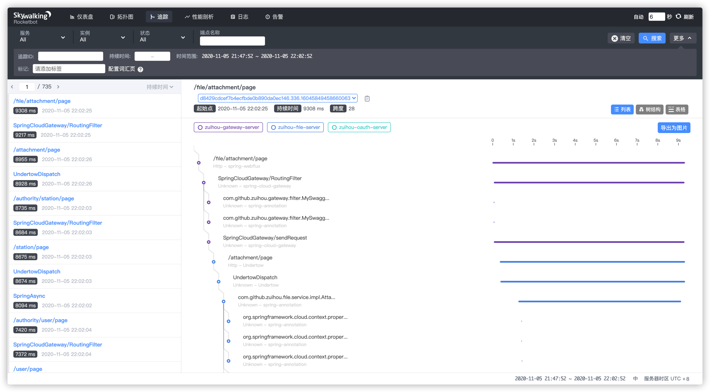
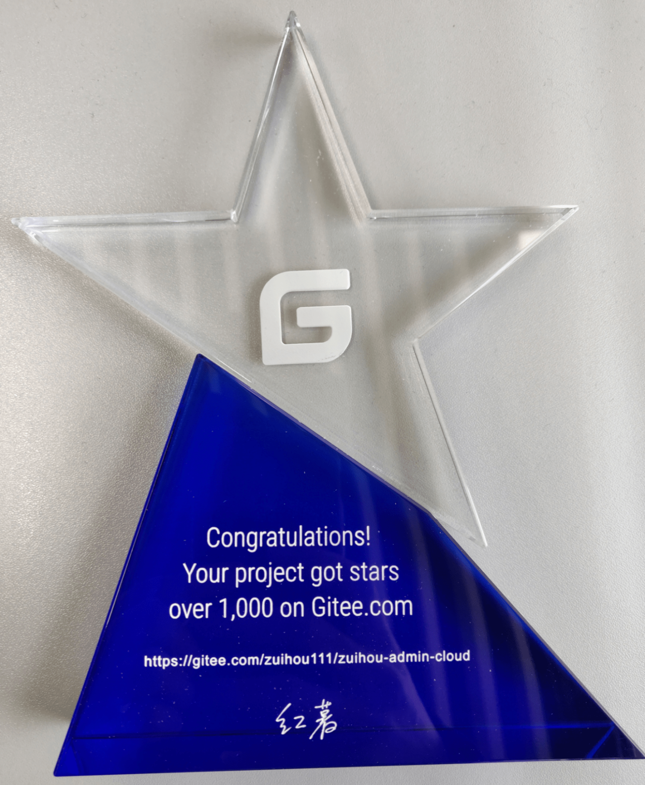

# lamp 快速开发平台

# 官网

[https://tangyh.top](https://tangyh.top)

## 小程序免费看文档

# lamp 项目名字由来

`灯灯`(简称灯， 英文名：lamp)，她是一个项目集，由"工具集"、"后端"、"前端"组成，为满足高内聚低耦合设计原则，将一个**大项目**
拆解为以下几个子项目：

[点我了解项目详细介绍](https://tangyh.top)

## 工具集

| 项目        | gitee                                              | github                                           | gitcode                                           | 备注       |
|-----------|----------------------------------------------------|--------------------------------------------------|---------------------------------------------------|----------|
| lamp-util | [lamp-util](https://gitee.com/zuihou111/lamp-util) | [lamp-util](https://github.com/zuihou/lamp-util) | [lamp-util](https://gitcode.com/zuihou/lamp-util) | 核心工具集    |
| lamp-job  | [lamp-job](https://gitee.com/zuihou111/lamp-job)   | [lamp-job](https://github.com/zuihou/lamp-job)   | [lamp-job](https://gitcode.com/zuihou/lamp-job)   | 分布式定时调度器 |

## 后端

| 项目         | gitee                                              | github                                              | gitcode                                             | 备注          |
|------------|----------------------------------------------------|-----------------------------------------------------|-----------------------------------------------------|-------------|
| lamp-cloud | [lamp-cloud](https://gitee.com/dromara/lamp-cloud) | [lamp-cloud](https://github.com/dromara/lamp-cloud) | [lamp-cloud](https://gitcode.com/zuihou/lamp-cloud) | 微服务和单体模式融合版 |

## 前端

| 项目       | gitee                                            | github                                         | gitcode                                         | 备注            | 演示地址                    |
|----------|--------------------------------------------------|------------------------------------------------|-------------------------------------------------|---------------|-------------------------|
| lamp-web | [lamp-web](https://gitee.com/zuihou111/lamp-web) | [lamp-web](https://github.com/zuihou/lamp-web) | [lamp-web](https://gitcode.com/zuihou/lamp-web) | 基于 vben-admin | https://none.tangyh.top |

## 注意：

- lamp-cloud 依赖 lamp-util
- lamp-job 依赖 lamp-util

所以，项目的编译顺序是：lamp-util -> lamp-cloud -> lamp-job

# 分支说明

新用户请直接学习和使用 java17/5.x 分支，其他分支是老版本代码。

# lamp-cloud 简介

`lamp-cloud`是基于`java`+ `SpringCloudAlibaba` +`SpringCloud`+`SpringBoot`
开发的微服务中后台快速开发平台，专注于多租户 (SaaS架构) 解决方案，亦可作为普通项目（非SaaS架构）的基础开发框架使用，目前已实现
**大租户嵌套小租户隔离**、**数据库隔离**、**字段隔离**、 **无租户隔离** 等几种模式。

她拥有自研RBAC（基于租户应用的角色权限控制体系）、网关统一鉴权、数据权限、优雅缓存解决方案、防缓存击穿、前后端统一表单校验、字典数据自动回显、可视化前后端代码生成器、支持多种文件存储、支持多种短信邮件发送接口、灰度发布、防XSS攻击、防SQL注入、分布式事务、分布式定时任务等功能；
支持多业务系统并行开发， 支持多服务并行开发，是中后台系统开发脚手架的最佳选择。

lamp-cloud 代码简洁，注释齐全，架构清晰，非常适合个人学习以及中小企业作为基础框架使用。采用Spring Cloud
Alibaba、SpringBoot、Mybatis、Seata、Sentinel、RabbitMQ、FastDFS/MinIO、SkyWalking等主要框架和中间件。 本项目旨在实现基础框架能力，不涉及具体业务。

# 演示地址

- 官网
    - [https://tangyh.top](https://tangyh.top)
- 文档
    - [https://tangyh.top/doc/%E7%AE%80%E4%BB%8B.html](https://tangyh.top/doc/%E7%AE%80%E4%BB%8B.html)
- 演示地址 
    - 数据源模式（vben5版）：演示地址：   [https://max-datasource.tangyh.top](https://max-datasource.tangyh.top)
    - 数据源模式（vben2版）：演示地址：   [https://datasource.tangyh.top](https://datasource.tangyh.top)
    - 字段模式（vben5版）：演示地址：   [https://max-column.tangyh.top](https://max-column.tangyh.top)
    - 字段模式（vben2版）：演示地址：   [https://column.tangyh.top](https://column.tangyh.top)
    - 非租户模式：演示地址：   [https://none.tangyh.top](https://none.tangyh.top)

## 广告位
- [MDP-主数据平台](https://gitee.com/henhen6/mddata) : 专注于**单点登录、开放平台和基础管理平台**解决方案。

# 作者参与过或PR过的项目

- [vue-vben-admin](https://github.com/vbenjs/vue-vben-admin) : vue3 + ant design vue 前端框架
- [soybean-admin](https://github.com/honghuangdc/soybean-admin) : vue3 + Naive UI 前端框架
- [electron-egg](https://github.com/wallace5303/electron-egg) : electron 桌面软件框架
- [knife4j](https://gitee.com/xiaoym/knife4j) : Swagger 在线文档
- [x-easypdf](https://gitee.com/dromara/x-easypdf) : pdf 工具
- [J2Cache](https://gitee.com/ld/J2Cache) : 2级缓存

# 优秀案例
- [MDP-主数据平台](https://gitee.com/henhen6/mddata)。 专注于单点登录中心、开放平台、基础管理平台解决方案
- 即时通讯系统： [HuLa-Server](https://github.com/HuLaSpark/HuLa-Server)

# 项目截图：

| 预览                                                   | 预览                                            |
|------------------------------------------------------|-----------------------------------------------|
|  |  |
|           |      |
|            |   |
|           |   |
|           |      |

# 赞助版

本项目分为开源版、企业商用版，github和gitee上能搜索到的为开源版本，遵循Apache协议。 赞助版源码在私有gitlab托管，购买后开通账号。

开源版是因为热爱，赞助版是妥协于生活。

开源版和赞助版区别请看：[赞助版](https://tangyh.top/vip/%E5%8A%9F%E8%83%BD%E5%AF%B9%E6%AF%94.html)

# 开源协议

Apache Licence 2.0 Licence是著名的非盈利开源组织Apache采用的协议。该协议和BSD类似，同样鼓励代码共享和尊重原作者的著作权，同样允许代码修改，再发布（作为开源或商业软件）。
需要满足的条件如下：

- 需要给代码的用户一份Apache Licence
- 如果你修改了代码，需要在被修改的文件中说明。
- 在延伸的代码中（修改和有源代码衍生的代码中）需要带有原来代码中的协议，商标，专利声明和其他原来作者规定需要包含的说明。
- 如果再发布的产品中包含一个Notice文件，则在Notice文件中需要带有Apache Licence。你可以在Notice中增加自己的许可，但不可以表现为对Apache
  Licence构成更改。 Apache Licence也是对商业应用友好的许可。使用者也可以在需要的时候修改代码来满足需要并作为开源或商业产品发布/销售。
-
若你借鉴或学习了本项目的源码，请你在你的项目源码和说明文档中显著的表明引用于本项目，并附上本项目的github访问地址。（https://github.com/dromara/lamp-cloud）
