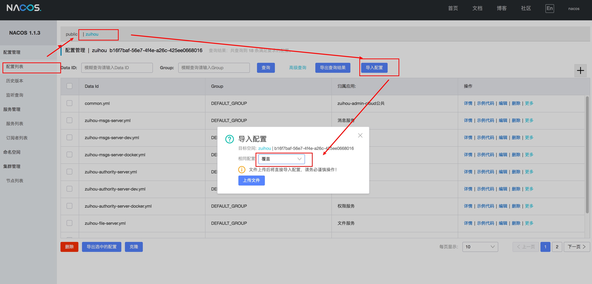
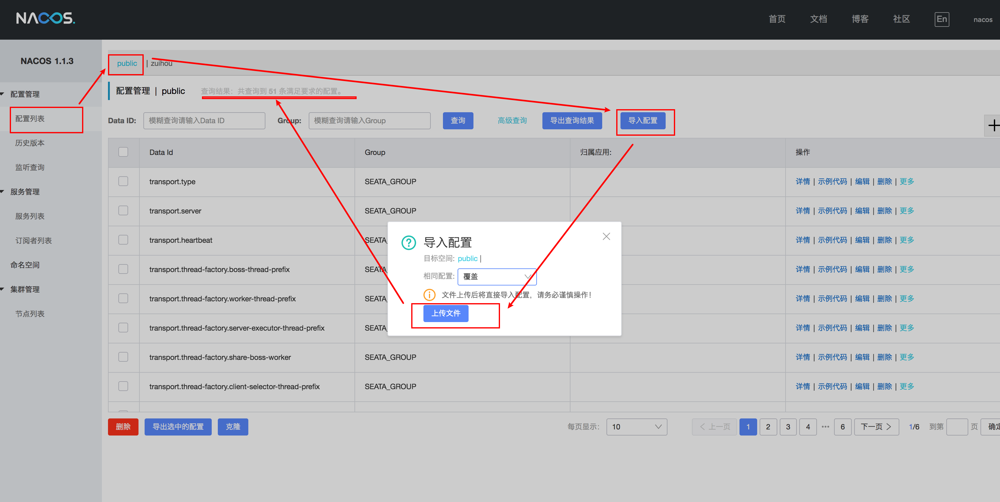
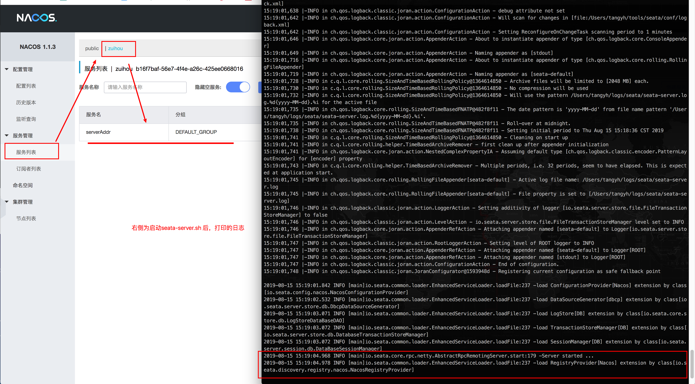

# 第三方组件启动说明
## 大文件上传JS
详情： http://fex.baidu.com/webuploader/
采用百度的Webupload.js + FileChunkController 实现的大文件/分片/续传功能

## Nacos
详情参考： https://nacos.io/zh-cn/docs/quick-start.html
由于压缩包太大， 放到代码里面不合适，所以需要自行去下载. 
本项目的third-party 文件夹下存放着作者修改好的配置文件，大家可以对比着改

### 下载
参考官方文档，下载当前最新版本： 1.1.3 （https://github.com/alibaba/nacos/releases），
下载后解压，然后按照下面的流程改配置。

或者直接下载我修改好了的压缩包： (  )

### 创建数据库，导入数据
- 创建nacos_test数据库
```
CREATE DATABASE `nacos_test` CHARACTER SET utf8mb4 COLLATE utf8mb4_general_ci;
```
- 导入 third-party/nacos/conf/nacos-mysql.sql

### 修改配置：
vim third-party/nacos/conf/application.properties
修改数据库配置
```
spring.datasource.platform=mysql
db.num=1
db.url.0=jdbc:mysql://127.0.0.1:3306/nacos_test?characterEncoding=utf8&connectTimeout=1000&socketTimeout=3000&autoReconnect=true
db.user=root
db.password=root
```

### 启动：
cd nacos

Linux/Unix/Mac
启动命令(standalone代表着单机模式运行，非集群模式):
sh bin/startup.sh -m standalone

Windows
启动命令：
cmd bin/startup.cmd

### 关闭：
Linux/Unix/Mac
sh bin/shutdown.sh
Windows
cmd bin/shutdown.cmd

### 访问
http://localhost:8848/nacos/
nacos/nacos

### 导入配置
- 新建命名空间： zuihou， 并记下命名空间id： b16f7baf-56e7-4f4e-a26c-425ee0668016

- 向命名空间(zuihou),导入zuihou-config/src/main/resources下的所有配置
- 一个一个新建太累？试试导入配置: third-party/nacos/nacos_config_zuihou_export_2019-08-15_14_17_03.zip

- 导入成功后，确定下命名空间： zuihou 下是否有18个配置
- 全文搜索将项目里面所有(bootstrap.yml、registry.conf)使用了 b16f7baf-56e7-4f4e-a26c-425ee0668016 的地方，将其替换成自己新创建的命名空间ID！  （这一步很重要！）


## seata
参考： http://blog.itpub.net/31555607/viewspace-2640669/
参考： https://github.com/seata/seata/wiki/Home_Chinese
官方文档指出： 1.0 之前的版本可能都不适合于生产使用（目前最新版本0.7.1），所以本组件仅用于 order-server和demo-server演示使用

由于压缩包太大， 放到代码里面不合适，所以需要自行去下载. 
本项目的third-party 文件夹下存放着作者修改好的配置文件，大家可以对比着改

### 下载
https://github.com/seata/seata/releases
参考官方文档，下载当前最新版本： 0.7.1
下载后解压，然后按照下面的流程改配置。

### 创建数据库，导入数据
- 创建seata数据库
```
CREATE DATABASE `seata` CHARACTER SET utf8mb4 COLLATE utf8mb4_general_ci;
```
- 导入 third-party/seata/conf/db_store.sql

### 修改配置
cd third-party/seata/conf/
file.conf (可选):  
```
store {
  ## store mode: file、db
  mode = "db"
  ## database store
  db {
     ## the implement of javax.sql.DataSource, such as DruidDataSource(druid)/BasicDataSource(dbcp) etc.
     datasource = "dbcp"
     ## mysql/oracle/h2/oceanbase etc.
     db-type = "mysql"
     url = "jdbc:mysql://127.0.0.1:3306/seata"
     user = "root"
     password = "root"
     min-conn = 1
     max-conn = 3
     global.table = "global_table"
     branch.table = "branch_table"
     lock-table = "lock_table"
     query-limit = 100
   }
}
```
logback.xml: (可选)
```
<property name="LOG_HOME" value="./logs/seata"/>
```
registry.conf
注意： namespace需要`修改成自己新创建的命名空间id`  ！！！
```
registry {  
  type = "nacos"
  nacos {
    serverAddr = "localhost"
    namespace = "b16f7baf-56e7-4f4e-a26c-425ee0668016"
    cluster = "default"
  } 
}
config {
    type = "nacos"
    nacos {
        serverAddr = "localhost"
        # 经过多次测试，这里只能用public， 改成其他的无效
        namespace = "public"
        cluster = "default"
      }
}
```
### 导入配置到nacos
linux/mac: 
sh nacos-config.sh localhost

官方没有提供window的脚本，需要在window导入的可以用python导入
nacos-config.py localhost

又是window，又不会python？
试试使用作者的压缩包直接导入到nacos即可。

- 向命名空间(public), 导入third-party/seata/conf/nacos-config.txt内的所有数据
- 一个一个新建太累？试试导入配置: third-party/seata/nacos_config_seata_export_2019-08-15_14_49_05.zip

- 导入成功后，确定下命名空间： public 下是否有51个配置

###启动
cd third-party/seata/
sh bin/seata-server.sh -p 8091 -h 192.168.1.34 -m db

参数解释： 
-p 指定端口
-h 指定ip，  需要修改成`自己的ip` ！！！
-m db   存储到数据库
-m file 存储到文件

window:
bin/seata-server.bat -p 8091 -h 192.168.1.34 -m db

### 验证是否启动成功
打开nacos， 【服务列表】 ->【zuihou】 -> 有一个服务名为： serverAddr 的服务 即表示成功 


### 在所有业务库中增加表：
CREATE TABLE `undo_log` (
  `id` bigint(20) NOT NULL AUTO_INCREMENT,
  `branch_id` bigint(20) NOT NULL,
  `xid` varchar(100) NOT NULL,
  `rollback_info` longblob NOT NULL,
  `log_status` int(11) NOT NULL,
  `log_created` datetime NOT NULL,
  `log_modified` datetime NOT NULL,
  `ext` varchar(100),
  PRIMARY KEY (`id`),
  KEY `idx_unionkey` (`xid`,`branch_id`)
) ENGINE=InnoDB DEFAULT CHARSET=utf8;

### 启动项目验证分布式事务 
1， 修改zuihou-order-server/zuihou-demo-server的bootstrap.yaml中的命名为空为 刚才新建的命名空间ID  
```
spring:
  cloud:
    nacos:
      config:
        namespace: b16f7baf-56e7-4f4e-a26c-425ee0668016
      discovery:
        namespace: b16f7baf-56e7-4f4e-a26c-425ee0668016
```

2，file.conf:  
修改规则： service.vgroup_mapping.${spring.cloud.alibaba.seata.tx-service-group} = default
其中： spring.cloud.alibaba.seata.tx-service-group 在 common.yml 文件中指定了
```
service {
    vgroup_mapping.zuihou_admin_seata_tx_group = "default"
}
```
3，registry.conf
```
registry {
  type = "nacos"
  nacos {
    serverAddr = "localhost"    # 修改成自己nacos的ip ！！！
    namespace = "b16f7baf-56e7-4f4e-a26c-425ee0668016"  #修改成自己新建的zuihou命名空间的ID ！！！
    cluster = "default"
  }
}

config {
  type = "nacos"
  nacos {
    serverAddr = "localhost"   # 修改成自己nacos的ip ！！！
    namespace = "public"       # 本人多次测试，这里只能public， 若你测试能修改成别的，可以留言告诉我方法
    cluster = "default"
  }
}
```
4, 启动  DemoServerApplication、OrderServerApplication， 测试 order-controller 中 SeataTxController 类的4个方法， 
发现
